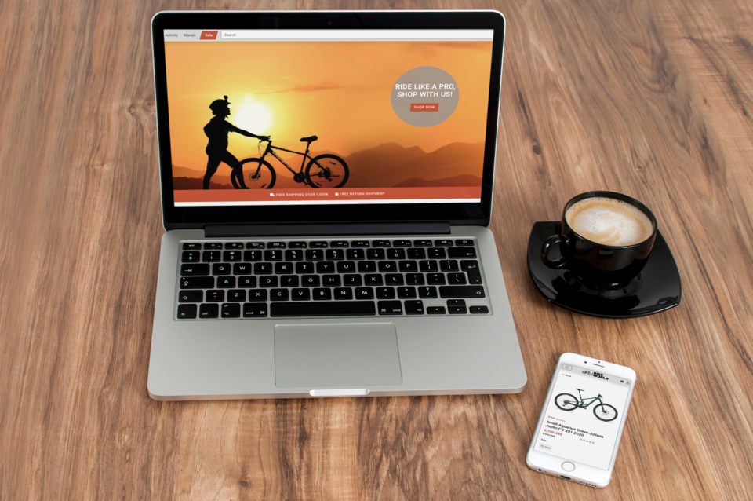
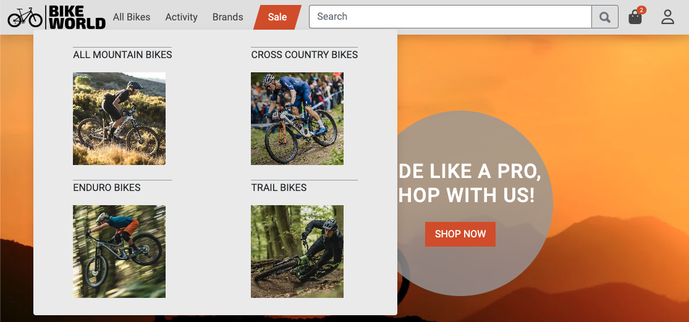
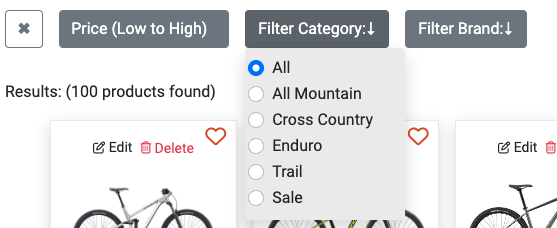
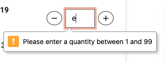
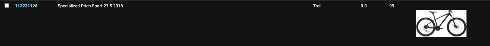

# BIKE WORLD
Welcome to **Bike World**! 

The ecommerce store offers a wide selection of top-quality mountain bikes, suitable for both beginners and seasoned riders.

At Bike World, we understand that mountain biking is not just a hobby, it's a passion. That's why we are committed to providing our customers with the best possible products and services. We carefully curate our selection of mountain bikes from trusted brands to ensure that our customers have access to the latest and greatest equipment.

Our user-friendly website allows you to browse our extensive collection of mountain bikes.

Please note that at this stage, **Bike World** is a fictitious store which has been created for the purposes of satisfying the requirements for the **Code Institute** Full Stack Development Course Project 5.




# Live Project

[View live project here](https://bike-world.herokuapp.com/)

## Contents

---
- [Target Audience](#target-audience)
- [Business Objectives](#business-objectives)
- [User Objectives](#user-objectives)
- [User Experience (UX)](#user-experience-ux)
    - [User Demographics](#user-demographics)
    - [User Requirements](#user-requirements)
    - [Site Map](#site-map)
    - [User Stories](#user-stories)
- [Design](#design)
    - [Colour Palette](#colour-palette)
    - [Fonts](#fonts)
    - [Images](#images)
    - [Wireframes](#wireframes)
- [Agile methodology](#agile-methodology)
    - [MoSCoW method and story points](#moscow-method-and-story-points)
    - [Iterations](#iterations)
- [Database Model](#database-model)
    - [Database](#database)
    - [Entity Relationship Diagram](#entity-relationship-diagram)
    - [Models](#models)
- [Features](#features)
    - [Implemented Features](#implemented-features)
    - [Future Features](#future-features)
- [Marketing and Social Media](#marketing-and-social-media)
    - [User Group](#user-group)
    - [Online Platforms](#online-platforms)
    - [Social Media](#social-media)
    - [User Needs](#user-needs)
    - [Promotions](#promotions)
    - [Budget](#budget)
    - [Facebook Business Page](#facebook-business-page)
    - [Mailchimp](#mailchimp)
- [Privacy Policy](#privacy-policy)
- [Error Pages](#error-pages)
- [Search Engine Optimization](#search-engine-optimization)
    - [sitemap.xml](#sitemapxml)
    - [robots.txt](#robotstxt)
    - [Sitemap Google Registration](#sitemap-google-registration)
    - [Googel Search Snippets](#google-search-snippets)
- [AWS Setup Process](#aws-setup-process)
    - [AWS S3 Bucket](#aws-s3-bucket)
    - [IAM Set Up](#iam-set-up)
    - [Connecting AWS to the Project](#connecting-aws-to-the-project)
- [Stripe Payments](#stripe-payments)
    - [Payments](#payments)
    - [Webhooks](#webhooks)
- [Technologies Used](#technologies-used)
    - [Languages](#languages)
    - [Framework](#framework)
    - [Programs](#programs)
- [Testing](#testing)
- [Deployment](#deployment)
- [References & Credit](#references-credit)

---

# <a name="target-audience">Target Audience</a>
The target audience for **Bike World** are mountain biking enthusiasts of all ages and experience levels. **Bike World** appeals to a wide range of customers, from beginners who are just starting out in the sport, to experienced riders who demand the latest and greatest equipment. **Bike World** understands that mountain biking is more than just a hobby, it's a lifestyle, and **Bike World** aims to provide a platform where like-minded individuals can come together and find the best equipment to support their passion.

# <a name="business-objectives">Business Objectives</a>
The primary business objective is to provide customers with a comprehensive online platform for purchasing top-quality mountain bikes. **Bike World** strives to offer a diverse selection of bikes from trusted brands, at competitive prices, with the convenience of online shopping. The goal is to establish **Bike World** as a leading ecommerce store for mountain bikes, with a reputation for excellent customer service and a commitment to providing the latest and greatest equipment. **Bike World** is committed to provid customers with an intuitive and enjoyable shopping experience. The website is designed with a user-friendly interface that is easy to navigate, with clear categories and filters that allow customers to quickly find the products they are looking for. 

# <a name="user-objectives">User Objectives</a>
The primary user objectives are to provide a wide range of high-quality mountain bikes at competitive prices, with a user-friendly online shopping experience. **Bike World** strives to offer customers the convenience of online shopping with the added benefit of expert product knowledge and exceptional customer service. Additionally, **Bike World** provides customers with access to detailed product information and reviews to help them make informed decisions about their purchase.

# <a name="user-experience-ux">User Experience (UX)</a>

## <a name="user-demographics">User Demographics</a>
The user demographics for Bike World are diverse, as mountain biking is a sport enjoyed by people of all ages and backgrounds. However, the primary target audience consists of males and females between the ages of 18 and 45 who are passionate about mountain biking. Bike World also caters to beginners who are just starting out in the sport, as well as experienced riders who are looking for the latest and greatest equipment.

## <a name="user-requirements">User Requirements</a>
Bike World customers require a comprehensive selection of high-quality mountain bikes, ranging from entry-level to premium models, with detailed product information and competitive pricing. We also recognize the importance of customer service and support, providing responsive and knowledgeable assistance to answer any questions or concerns. Additionally, customers require a secure and easy-to-use online platform, with a streamlined checkout process. To enhance the user experience, Bike World understands the importance of providing a wishlist feature to save products for later purchase and an intuitive platform that is easy to navigate.

## <a name="site-map">Site Map</a>
[_Sourced via Octopus_](https://octopus.do/)


## <a name="user-stories">User Stories</a>

- As a site user,
  - [#9](https://github.com/kerstin-w/Bike-World/issues/9) I want to navigate to the landing page firstly so that I can see what the store is about
  - [#10](https://github.com/kerstin-w/Bike-World/issues/10) I can navigate through the site from the navbar so that it is easy to access the key components of the site
  - [#14](https://github.com/kerstin-w/Bike-World/issues/14) I can search for a product by a keyword so that I can find products relative to the keyword
  - [#15](https://github.com/kerstin-w/Bike-World/issues/15) I can create an account so that sign in and make use of the site full functionality
  - [#18](https://github.com/kerstin-w/Bike-World/issues/18) I can log in with my social media accounts so that it is very easy to create an account to use the site
  - [#20](https://github.com/kerstin-w/Bike-World/issues/20) I can See a list of products with the ability to click on each item for more information so that I can make informed purchases.
  - [#21](https://github.com/kerstin-w/Bike-World/issues/21) I can select a certain segment so that I can only view relevant products
  - [#22](https://github.com/kerstin-w/Bike-World/issues/22) I can sort and filter products so that I can see relevant products to purchase and make a better decision
  - [#23](https://github.com/kerstin-w/Bike-World/issues/23) I can add products to my cart so that can review my selected products and make a purchase
  - [#24](https://github.com/kerstin-w/Bike-World/issues/24) I can view my shopping cart so that I have an overview of the items I want to purchase
  - [#25](https://github.com/kerstin-w/Bike-World/issues/25) I can adjust the quantity of a product in my cart so that purchase the quantity I desire
  - [#26](https://github.com/kerstin-w/Bike-World/issues/26) I can delete products from my cart so that I don't have to purchase the product in case I changed my mind
  - [#27](https://github.com/kerstin-w/Bike-World/issues/27) I am always informed about actions I take so that I am assured they were successful or receive supportive information in case of an error
  - [#28](https://github.com/kerstin-w/Bike-World/issues/28) I am redirected to a checkout page so that I can make a purchase
  - [#29](https://github.com/kerstin-w/Bike-World/issues/29) I can see a confirmation of my purchase so that I am assured the purchase was successful
  - [#32](https://github.com/kerstin-w/Bike-World/issues/32) I can Sign Up for the newsletter so that I can keep up to date with deals and events
  - [#33](https://github.com/kerstin-w/Bike-World/issues/33) I can see an option to get in contact with the shop so that reach out for support
  - [#34](https://github.com/kerstin-w/Bike-World/issues/34) I can find answers to frequently asked questions easily so that I can quickly resolve my queries
  - [#35](https://github.com/kerstin-w/Bike-World/issues/35) I can view reviews of products on the online store so that I can make an informed decision before making a purchase
  - [#37](https://github.com/kerstin-w/Bike-World/issues/37) I can receive a discount code when I sign up for the newsletter so that I can use it towards my first
  - [#38](https://github.com/kerstin-w/Bike-World/issues/38) I can easily apply my discount code to my purchase so that I can receive the discount
  - [#42](https://github.com/kerstin-w/Bike-World/issues/42) I can be routed to a error page in case a page is not found so that I understand the error and click on a link to get back to the homepage

<br>

- As a registered user,
    - [#16](https://github.com/kerstin-w/Bike-World/issues/16) I can log in and out so that so that I can protect my account and use the sites full functionality
    - [#17](https://github.com/kerstin-w/Bike-World/issues/17) I can reset my password so that I can always access my account and my account stays secure
    - [#19](https://github.com/kerstin-w/Bike-World/issues/19) I can a welcome email so that I am assured that my account was created successfully
    - [#30](https://github.com/kerstin-w/Bike-World/issues/30) I can edit my account so that personal data stays up to date
    - [#31](https://github.com/kerstin-w/Bike-World/issues/31) I can delete my account so that I can remove my footprint from the website if I am no longer useing it
    - [#36](https://github.com/kerstin-w/Bike-World/issues/36) I can leave a review for a product I have purchased so that I can share my experience with others
    - [#39](https://github.com/kerstin-w/Bike-World/issues/39) I can create and add products to my wishlist so that I can keep track of products that I am interested in and plan future purchases more easily
    - [#40](https://github.com/kerstin-w/Bike-World/issues/40) I can see related products on the product detail page (PDP) so that I can easily discover alternative products

<br>

- As a Superuser,
    - [#11](https://github.com/kerstin-w/Bike-World/issues/11) I can add a new product to the database so that I can expand my assortment
    - [#12](https://github.com/kerstin-w/Bike-World/issues/12) I can Edit products so that I can keep all information updated
    - [#13](https://github.com/kerstin-w/Bike-World/issues/13) I can delete products from the database so that remove obsolete products
    - [#41](https://github.com/kerstin-w/Bike-World/issues/41) I can have a dashbaord in the admin panel so that I can view and manage key metrics

<br>

- As a store owner,
    - [#43](https://github.com/kerstin-w/Bike-World/issues/43) I want to create a sitemap and robots.txt file for my website so that search engines can properly index and crawl my pages
    - [#44](https://github.com/kerstin-w/Bike-World/issues/44) I want to create a Facebook page for my e-commerce business so that I can increase visibility and engage with customers
    - [#45](https://github.com/kerstin-w/Bike-World/issues/45) I want to quickly understand, how the page works. I need the README file to provide clear and concise instructions and documentation.

<br>

# <a name="design">Design</a>

## <a name="colour-palette">Colour Palette</a>


To create a simple design that does not distract customers from the essential areas, only few colors are used.  White is used as the main background color, which creates a clear and bright design. 
The font is predominantly black, which creates a good contrast and is easily readable for customers. 
Certain areas and segments have a  light gray color to highlight and accentuate them. This provides a subtle contrast to the predominantly white background and draws attention to important elements of the design. 
An  orange color has been chosen for all call-to-action buttons and promotional/sale segments. This color stands out and grabs the user's attention, as Bike World wants to guide the customer to the checkout and purchase process as easily as possible. The orange color creates a sense of urgency and encourages the user to take action. By using this color, Bike World aims to optimize the user experience, drive sales and reduce the abondend cart rate.

After testing the accessibility, the inital orange was changed to a darker orange to achieve a better contrast between the orange background and the white text from buttons.

## <a name="fonts">Fonts</a>
[_Sourced via Google Fonts._](https://fonts.google.com/)

Using a consistent font throughout a website is important for creating a cohesive and easy-to-use experience for the user. This is why **Roboto** was choosen as font for Bike world.
Roboto is a versatile sans-serif font that was designed by Google in 2011 specifically for use on the Android operating system. Roboto has a clean and modern appearance, legibility, and versatility. Roboto is designed to be easily legible at various sizes, making it a great choice for both body text and headings. Its clean lines and open letterforms make it easy to read on both small screens and large displays.
Overall, using a consistent font helps to create a polished and professional look for Bike World, while also improving the user experience by providing clear and easy-to-read text.

## <a name="images">Images</a> 

[*Sourced via Pexels.*](https://www.pexels.com/)

In an online shop, images are an essential element of the user experience. They provide visual cues and help users understand what the products look like in real life. In my shop, I have used images in the hero banner and category callouts to showcase the bikes in action. The hero banner is the first thing that users see when they arrive on the site. By using an image that shows a bike in action, users can quickly understand the main purpose of the site and the type of products that are being sold. This helps to create an emotional connection with the user and encourages them to explore the site further. Similarly, the category callouts use images to showcase the different types of bikes that are available. By showing the bikes in action, users can understand how they might use the bikes in their own lives. This helps to make the products more relatable and can encourage users to make a purchase.
Product images from the [**Kegel**](https://www.kaggle.com/datasets/tysonpo/bike-ads-images-prices-specifications?select=data_bike_exchange.json) data set were used for the PDPs. Improvements are still desirable in this regard. In an ideal scenario, there would be several pictures of the bike with detail shots. The format would be webp and the quality a slightly better so that a zoom could also be built in. 

## <a name="wireframes">Wireframes</a> 

<details>
    <summary>Homepage</summary>
    
</details>

<details>
    <summary>CLP (Category Landing Page)</summary>
    
</details>

<details>
    <summary>PDP (Product Landing Page)</summary>
    
</details>

<details>
    <summary>Shopping Bag</summary>
    
</details>

<details>
    <summary>Checkout</summary>
    
</details>

<details>
    <summary>Checkout Success</summary>
    
</details>

<details>
    <summary>Profile</summary>
    
</details>

<details>
    <summary>Add/Edit Product</summary>
    
</details>

# <a name="agile-methodology">Agile methodology</a>

All functionality and development of this project were managed using GitHub which Projects can be found
[here](https://github.com/users/kerstin-w/projects/7)

## <a name="moscow-method-and-story-points">MoSCoW method and story points</a>

To implement agile methodology, the Kanban board and Issues feature on GitHub Projects were utilized. 
8 Epics were created which were then further developed into User Stories. User stories were first created and then prioritized using the MoSCoW method. The points were assigned to each story based on their complexity, amount of work, and repetition using a modified Fibonacci sequence (1, 2, 3, 5, and so on). Each User Story was assigned a classification of `Must Have`, `Should Have`, `Could Have` or `Won't Have` and re-evaluated in each Iteration.  In practice, some of the User Stories were completed quicker than anticipated and other User Stories took longer.

[One EPIC](https://github.com/kerstin-w/Bike-World/issues/7) and two User Stories ([#37](https://github.com/kerstin-w/Bike-World/issues/37), [#38](https://github.com/kerstin-w/Bike-World/issues/38)) were not completed at all. This feature was a `Could Have` from the beginning. I put some thought into the implementation of this feature, but due to its complexity I decided to use the remaining time to improve the features I had and overall user experience, instead of adding another feature. Read more in [Future Features](#future-features).

The details are as follows:

- [EPIC: Landing Page](https://github.com/kerstin-w/Bike-World/issues/1)

    | Issue # | User Story | Prioritisation | Points |
    | :-----------: | :---------: | :-----------: | :-----------: |
    | [#9](https://github.com/kerstin-w/Bike-World/issues/9) | As a Site User I want to navigate to the landing page firstly so that I can see what the store is about | Must Have | 4 |
    | [#10](https://github.com/kerstin-w/Bike-World/issues/10) | As a Site User I can navigate through the site from the navbar so that it is easy to access the key components of the site | Must Have | 2 |
    | [#14](https://github.com/kerstin-w/Bike-World/issues/14) | As a Unregistered User I can select a category so that I can only view relevant posts. | Must Have | 2 |

<br>

- [EPIC: Create and View Products](https://github.com/kerstin-w/Bike-World/issues/2)

    | Issue # | User Story | Prioritisation | Points |
    | :-----------: | :---------: | :-----------: | :-----------: |
    | [#11](https://github.com/kerstin-w/Bike-World/issues/11) | As a Superuser I can add a new product to the database so that I can expand my assortment | Should Have | 3 |
    | [#12](https://github.com/kerstin-w/Bike-World/issues/12) | As a Superuser I can Edit products so that I can keep all information updated | Should Have | 3 |
    | [#13](https://github.com/kerstin-w/Bike-World/issues/13) | As a superuser I can delete products from the database so that remove obsolete products | Could Have | 2 |
    | [#14](https://github.com/kerstin-w/Bike-World/issues/14) | As a Site User I can search for a product by a keyword so that I can find products relative to the keyword | Must Have | 2 |
    | [#21](https://github.com/kerstin-w/Bike-World/issues/21) | As a Site User I can select a certain segment so that I can only view relevant products | Could Have | 1 |
    | [#22](https://github.com/kerstin-w/Bike-World/issues/22) | As a Site user I can sort and filter products so that I can see relevant products to purchase and make a better decision | Should Have | 4 |

<br>

- [EPIC: User Profile](https://github.com/kerstin-w/Bike-World/issues/3)

    | Issue # | User Story | Prioritisation | Points |
    | :-----------: | :---------: | :-----------: | :-----------: |
    | [#15](https://github.com/kerstin-w/Bike-World/issues/15) | As a Site User I can create an account so that sign in and make use of the site full functionality | Could Have | 3 |
    | [#16](https://github.com/kerstin-w/Bike-World/issues/16) | As a registered user I can log in and out so that so that I can protect my account and use the sites full functionality | Must Have | 3 |
    | [#17](https://github.com/kerstin-w/Bike-World/issues/17) | As a registered user I can reset my password so that I can always access my account and my account stays secure | Could Have | 2 |
    | [#18](https://github.com/kerstin-w/Bike-World/issues/18) | As a Site User I can log in with my social media accounts so that it is very easy to create an account to use the site | Must Have | 3 |
    | [#19](https://github.com/kerstin-w/Bike-World/issues/19) | As a Registered User I can a welcome email so that I am assured that my account was created successfully | Must Have | 2 |
    | [#30](https://github.com/kerstin-w/Bike-World/issues/30) | As a Registered User I can edit my account so that personal data stays up to date | Must Have | 3 |
    | [#31](https://github.com/kerstin-w/Bike-World/issues/31) | As a Registered User I can delete my account so that I can remove my footprint from the website if I am no longer useing it | Must Have | 2 |

<br>

- [EPIC: Shopping Cart and Checkout](https://github.com/kerstin-w/Bike-World/issues/4)

    | Issue # | User Story | Prioritisation | Points |
    | :-----------: | :---------: | :-----------: | :-----------: |
    | [#20](https://github.com/kerstin-w/Bike-World/issues/20) | As a Site User I can See a list of products with the ability to click on each item for more information so that I can make informed purchases. | Must Have | 3 |
    | [#23](https://github.com/kerstin-w/Bike-World/issues/23) | As a Site User I can add products to my cart so that can review my selected products and make a purchase | Could Have | 4 |
    | [#24](https://github.com/kerstin-w/Bike-World/issues/24) | As a Site User I can view my shopping cart so that I have an overview of the items I want to purchase | Must Have | 4 |
    | [#25](https://github.com/kerstin-w/Bike-World/issues/25) | As a Site User I can adjust the quantity of a product in my cart so that purchase the quantity I desire | Must Have | 2 |
    | [#26](https://github.com/kerstin-w/Bike-World/issues/26) | As a Site User I can delete products from my cart so that I don't have to purchase the product in case I changed my mind | Must Have | 2 |
    | [#28](https://github.com/kerstin-w/Bike-World/issues/28) | As a Site User I am redirected to a checkout page so that I can make a purchase | Could Have | 6 |
    | [#29](https://github.com/kerstin-w/Bike-World/issues/29) | As a Site User I can see a confirmation of my purchase so that I am assured the purchase was successful | Must Have | 2 |

<br>

- [EPIC: User Feedback](https://github.com/kerstin-w/Bike-World/issues/5)

    | Issue # | User Story | Prioritisation | Points |
    | :-----------: | :---------: | :-----------: | :-----------: |
    | [#27](https://github.com/kerstin-w/Bike-World/issues/27) | As a Site User I am always informed about actions I take so that I am assured they were successful or receive supportive information in case of an error | Should Have | 3 |

<br>

- [EPIC: Customer Review](https://github.com/kerstin-w/Bike-World/issues/6)

    | Issue # | User Story | Prioritisation | Points |
    | :-----------: | :---------: | :-----------: | :-----------: |
    | [#35](https://github.com/kerstin-w/Bike-World/issues/35) | As a Site User I can view reviews of products on the online store so that I can make an informed decision before making a purchase | Could Have | 2 |
    | [#36](https://github.com/kerstin-w/Bike-World/issues/36) | As a registered user I can leave a review for a product I have purchased so that I can share my experience with others | Could Have | 4 |

<br>

- [EPIC: Discount Code](https://github.com/kerstin-w/Bike-World/issues/7)

    | Issue # | User Story | Prioritisation | Points |
    | :-----------: | :---------: | :-----------: | :-----------: |
    | [#37](https://github.com/kerstin-w/Bike-World/issues/37) | As a site user I can receive a discount code when I sign up for the newsletter so that I can use it towards my first purchase | Will Not Have | 1 |
    | [#38](https://github.com/kerstin-w/Bike-World/issues/38) | As a Site user I can easily apply my discount code to my purchase so that I can receive the discount | Will Not Have | 5 |

<br>

- [EPIC: Wishlist](https://github.com/kerstin-w/Bike-World/issues/8)

    | Issue # | User Story | Prioritisation | Points |
    | :-----------: | :---------: | :-----------: | :-----------: |
    | [#39](https://github.com/kerstin-w/Bike-World/issues/39) | As a registered user I can create and add products to my wishlist so that I can keep track of products that I am interested in and plan future purchases more easily | Must Have | 4 |

<br>

### <a name="iterations">Iterations</a>

The project was carried out over 4 iterations and each iteration lasted 7-8 days. For personal and professional reasons, I had only limited time for iterations 5 and 6, so few story points were awarded here. And between iteration 5 and 6, the story points for story #37 and #38 were adjusted as well due to the complexity becoming known. 

- **Iteration 1 (Closed points 20 / Planned points 20)**

    

- **Iteration 2 (Closed points 20 / Planned points 20)**

    

- **Iteration 3 (Closed points 20 / Planned points 20)**

    

- **Iteration 4 (Closed points 20 / Planned points 20)**

    

- **Iteration 5 (Closed points 12 / Planned points 9)**

    

- **Iteration 6 (Closed points 18 / Planned points 12)**

    

As already stated, two User Stories ([#37](https://github.com/kerstin-w/Bike-World/issues/37), [#38](https://github.com/kerstin-w/Bike-World/issues/38)) were not completed at all. They were first not closed in Iteration 5 and then pushed to Iteration 6, where they were also not closed. This feature was a `Could Have` from the beginning. I put some thought into the implementation of this feature, but due to its complexity I decided to use the remaining time to improve the features I had and overall user experience, instead of adding another feature. Read more in [Future Features](#future-features).

# <a name="database-model">Database Model</a>

## <a name="database">Database</a>

[PostgreSQL](https://www.postgresql.org/) was used for the main database from the earliest stage of development.

The database has been switched to [ElephantSQL](https://www.elephantsql.com/).

<br>

## <a name="entity-relationship-diagram">Entity Relationship Diagram</a>
[Created with diagrams.net](https://app.diagrams.net/)


<br>

## <a name="models">Models</a>

- **Checkout App:**
- Order
    | Field Name | Type | Arguments |
    | :--------: | :--: | :-------: |
    | order_number | CharField | max_length=10, null=False, editable=False |
    | user_profile | ForeignKey | max_length=30, UserProfile, on_delete=models.SET_NULL, null=True, blank=True, related_name="orders", |
    | full_name | CharField | max_length=settings.FULL_NAME_MAX_LENGTH, null=False, blank=False |
    | email | EmailField | max_length=254, null=False, blank=False |
    | phone_number | CharField | max_length=settings.PHONE_NUMBER_MAX_LENGTH, null=False, blank=False|
    | country | CountryField | blank_label="Country *", null=False, blank=False |
    | postcode | Charfield | max_length=settings.POSTCODE_MAX_LENGTH, null=True, blank=True |
    | town_or_city | Charfield | max_length=settings.TOWN_OR_CITY_MAX_LENGTH, null=False, blank=False |
    | street_address1 | Charfield | max_length=settings.STREET_ADDRESS1_MAX_LENGTH, null=False, blank=False |
    | street_address2 | Charfield | max_length=settings.STREET_ADDRESS2_MAX_LENGTH, null=False, blank=False |
    | date | DateTimeField | auto_now_add=True |
    | delivery_cost | DecimalField | max_digits=6, decimal_places=2, null=False, default=0 |
    | order_total | DecimalField | max_digits=10, decimal_places=2, null=False, default=0 |
    | grand_total | DecimalField | max_digits=10, decimal_places=2, null=False, default=0 |
    | original_bag | TextField| null=False, blank=False, default="" |
    | stripe_pid | TextField| max_length=254, null=False, blank=False, default="" |

    - Metadata

        ```
        class Meta:
            ordering = ['-date']
        ```

    - Methods

        ```
        def _generate_order_number(self):
            return uuid.uuid4().hex.upper()[:10]
        ```

        ```
        def update_total(self):

            self.order_total = (
                self.lineitems.aggregate(Sum("lineitem_total"))[
                    "lineitem_total__sum"
                ]
                or 0
            )
            if 0 < self.order_total < settings.FREE_DELIVERY_THRESHOLD:
                self.delivery_cost = settings.STANDARD_DELIVERY_COST
            else:
                self.delivery_cost = 0
            self.grand_total = self.order_total + self.delivery_cost
            self.save()
        ```

        ```
        def save(self, *args, **kwargs):
            if not self.order_number:
                self.order_number = self._generate_order_number()
            super().save(*args, **kwargs)
        ```

        ```
        def __str__(self):
         return self.order_number
        ```

Order Model is related to OrderLineItem and UserProfile. It saves Orders after successful checkout. Order order_number field is automatically added on save. Order_total, grand_total, and delivery fields are automatically updated using a Django signal when an OrderLineItem is added or deleted. Max_Lenght for shipping information is stored in settings to make it easier to find and update them.

        ```
        FREE_DELIVERY_THRESHOLD = 1000
        STANDARD_DELIVERY_COST = 10

        FULL_NAME_MAX_LENGTH = 50
        PHONE_NUMBER_MAX_LENGTH = 20
        COUNTRY_MAX_LENGTH = 40
        POSTCODE_MAX_LENGTH = 20
        TOWN_OR_CITY_MAX_LENGTH = 40
        STREET_ADDRESS1_MAX_LENGTH = 80
        STREET_ADDRESS2_MAX_LENGTH = 80
        ```


- OrderLineItem
    | Field Name | Type | Arguments |
    | :--------: | :--: | :-------: |
    | order | ForeignKey | Order, null=False, blank=False, on_delete=models.CASCADE, related_name="lineitems" |
    | product | ForeignKey | Product, null=False, blank=False, on_delete=models.CASCADE |
    | quantity | IntegerField | null=False, blank=False, default=0 |
    | lineitem_total | DecimalField | max_digits=6, decimal_places=2, null=False, blank=False, editable=False |

    - Methods

        ```
        def save(self, *args, **kwargs):
            if self.product.sale:
                self.lineitem_total = self.product.sale_price * self.quantity
            else:
                self.lineitem_total = self.product.retail_price * self.quantity
            super().save(*args, **kwargs)
        ```

        ```
        def __str__(self):
            return f"SKU {self.product.sku} on order {self.order.order_number}"
        ```
OrderLineItem Model is related to Order and Product. It stores each OrderLineItem after successful checkout. OrderLineItem line_item_total field is automatically calculated on save.

- **Products App:**
- Category
    | Field Name | Type | Arguments |
    | :--------: | :--: | :-------: |
    | name | CharField | max_length=254 |
    | friendly_name | Charfield | max_length=254 |

    - Metadata

        ```
        class Meta:
            verbose_name_plural = "Categories"
        ```

    - Methods

        ```
        def __str__(self):
            return self.friendly_name
        ```
        ```
        def get_friendly_name(self):
            return self.friendly_name
        ```
Category stores the category name, which is one of different types of mountainbike activities.

- Product
    | Field Name | Type | Arguments |
    | :--------: | :--: | :-------: |
    | title | CharField | max_length=254, unique=True |
    | sku | Charfield | max_length=254, null=True, blank=True, unique=True |
    | category | ForeignKey | "Category", null=True, blank=True, on_delete=models.SET_NULL |
    | description | TextField | |
    | wheel_size | CharField |max_length=100, null=True, blank=True |
    | retail_price | DecimalField | max_digits=7, decimal_places=2 |
    | sale_price | DecimalField | max_digits=6, decimal_places=2, null=True, blank=True |
    | sale | BooleanField | default=False, null=True, blank=True |
    | image | ImageField | null=True, blank=True, upload_to="products/" |
    | brand | CharField | max_length=100 |
    | bike_type | CharField | max_length=200 |
    | gender | IntegerField | choices=GENDER, default=0 |
    | material | CharField | max_length=100, null=True, blank=True |
    | derailleur | CharField | max_length=100, null=True, blank=True |
    | stock | IntegerField | default=99 |
    | rating | FloatField | null=True, blank=True |

        ```
        GENDER = ((0, "Unisex"), (1, "Womens"), (2, "Mens"))
        ```

    - Methods

        ```
        def __str__(self):
            return self.title
        ```

        ```
        def get_gender_display(self):
            return dict(GENDER)[self.gender]
        ```

        ```
        def image_tag(self):
            if self.image:
                image_url = f"{settings.MEDIA_URL}{self.image}"
                return mark_safe(
                    f''
                )
            else:
                return "No Image Found"
        ```

        ```
        def get_related_products(self):
            return Product.objects.filter(category=self.category).exclude(
                id=self.id
            )[:4]
        ```

        ````
        def clean(self):
            super().clean()
            if self.sale and not self.sale_price:
                raise ValidationError("Sale price is required.")
        ```

        ```
        def save(self, *args, **kwargs):
            if self.sale:
                sale_category = Category.objects.get(name="sale")
                self.category = sale_category
            super().save(*args, **kwargs)
        ````

Product Model is related to Category. It represents the essential attributes and methods required to store and retrieve information about products. The get_gender_display method returns a display value for gender. The image_tag method generates a HTML image tag for the product image an is used in the Admin Panel. The get_related_products method retrives the first four products that belong to the same category as the current product and excludes the current product. The clean method makes sale_price a required field in case sale was set to true. The save method saves the product in category "sale" in case sale was set to true.

- **Profiles App:**
- UserProfile
    | Field Name | Type | Arguments |
    | :--------: | :--: | :-------: |
    | user | OneToOneField | User, on_delete=models.CASCADE |
    | default_full_name | Charfield | max_length=settings.FULL_NAME_MAX_LENGTH, null=False, blank=False |
    | default_email | EmailField | max_length=254, null=False, blank=False |
    | default_phone_number | CharField | max_length=20, null=True, blank=True |
    | default_country | CountryField | blank_label="Country", null=True, blank=True |
    | default_postcode | Charfield | max_length=20, null=True, blank=True |
    | default_town_or_city | Charfield | max_length=40, null=True, blank=True |
    | default_street_address1 | Charfield | mmax_length=80, null=True, blank=True |
    | default_street_address2 | Charfield | max_length=80, null=True, blank=True |

    - Methods

        ```
        def __str__(self):
            return self.user.username
        ```

UserProfile Model is related to User and allows the storage of user-specific shipping information and provides a link between the user and their profile, enabling easy access to default information for shipping orders.

- Wishlist
    | Field Name | Type | Arguments |
    | :--------: | :--: | :-------: |
    | user | ForeignKey | User, on_delete=models.CASCADE, related_name="wishlist" |
    | product | ForeignKey | Product, on_delete=models.CASCADE |

    - Methods

        ```
        def is_product_in_wishlist(self):
            return Wishlist.objects.filter(
                user=self.user, product=self.product
            ).exists()
        ```
Wishlist Model is related to User and Product and allows users to add products to their wishlist and provides a way to associate users with their desired products. It enables easy retrieval of wishlist products for a specific user and the ability to check if a product is already in the wishlist. The is_product_in_wishlsit method checks if a Wishlist object is matching with user and product in the database and returns a boolean indicating whether the associated product is present in the user's wishlist.

- ProductReview
    | Field Name | Type | Arguments |
    | :--------: | :--: | :-------: |
    | product | ForeignKey | Product, on_delete=models.CASCADE, related_name="reviews" |
    | user | ForeignKey | User, on_delete=models.CASCADE |
    | review | TextField | |
    | rating | PositiveIntegerField | default=1, validators=[MinValueValidator(1), MaxValueValidator(5)], null=True, blank=True |
    | created_at | DateTimeField | auto_now_add=True |

    - Methods

        ```
        def __str__(self):
            return f"{self.user.username} - {self.product.title}"
        ```

        ```
        def save(self, *args, **kwargs):
            super(ProductReview, self).save(*args, **kwargs)

            # Update the rating field of the Product instance
            # with the average rating.
            self.product.rating = self.product.reviews.aggregate(Avg("rating"))[
                "rating__avg"
            ]

            # Save the Product instance with the new rating.
            self.product.save()
        ```

        ```
        @classmethod
        def get_reviews_for_product(cls, product):
            return cls.objects.filter(product=product).order_by('-created_at')
        ```

ProductReview Model is related to User and Product allows users to submit reviews for products, associate reviews with specific products and users, and update the average rating of the associated product based on the submitted reviews. The get_reviews_for_product method retrieves all reviews for a specific product, ordered by the creation date in descending order. Additionally, there is a signal receiver function that creates or updates the associated UserProfile object when a User is saved. It creates a new UserProfile object if the User was just created.

# <a name="features">Features</a>

## <a name="implemented-features">Implemented Features</a>

### Navbar
On the page a navbar has been implemented and is responsive and sticky on top. It was essential to create a tidy navbar design that is intuitive for the user and not overloaded with selections that would overwhelm the user. In addition, it was important to create a direct point through which the user has an uncomplicated checkout. This is achieved when the user clicks on the shopping bag icon and has direct access to the checkout option. It is important that the customer has as few clicks as possible to finalize the checkout process. 

- Navbar items **All Bikes, Activity, Brands, Sale, Logo, Search, Bag and Login/Register** are available for unregistered/not logged in users.
- Registered Users, when logged in can also see their Profile, by clicking on the account icon and selecting **My Profile**
- The Navbar is fixed to the top of the screen even when the user is scrolling down the page to allow easier navigation.
- The logo is linked to the Homepage and each menu item is linked to each segmentation respectively to allow easier navigation.
- The search bar allows users to easily search for a keyword they are looking for.
- The navigation menu collapses on small/medium devices to optimise the menu for smaller screen sizes.
- The Bag Icon in the Navbar shows the number of products in the bag via a little badge. 
- When the user hovers over the menu items Activity or Brand, a menu is opened for the user to choose from.

<details>
    <summary>Navbar Desktop</summary>




</details>

<details>
    <summary>Navbar Mobile</summary>


</details>

### Home Page

The home page is divided into multiple segments. The **Hero Banner, Category Callouts and Top Products**. 

### Home Page - Hero Banner

- The Hero banner is designed to be visually appealing and provide a direct call-to-action with the "Shop Now" button so the customer can start shopping right away. In addition, below the Hero banner, but still in the first direct view of the user, is the **Reason-Why banner**, which gives the user reasons to shop at Bike World.


<br>

### Home Page - Category Callouts

- The category callout area is used to highlight specific parts of the product range or promotions. When clicking on one of these callouts, the customer will be redirected to the corresponding CLP. 


<br>

### Home Page - Category Callouts

Of course, it is important to display products to the customer on the first page. Therefore, there is the **Top Products** segment. The best rated products are listed here. On desktop there are four products and on mobile correspondingly less. 

- Products can be added directly to the shopping cart, making it as effortless as possible for the customer to add products to the cart and purchase them. 
- By clicking on the article the user is redirected to the PDP
- Registered users will see a heart in the upper right corner. By clicking on it, users can add the item to their wishlist.


<br>

### Footer

- In the footer, users can sign up for the newsletter.
- In the footer you can access further pages about **Support** and **About** Bike World.


<br>

### CLP (Category Landing Page)

- The CLP shows all products of the selected category. 
- Products can be added directly to the shopping cart, making it as effortless as possible for the customer to add products to the cart and purchase them. 
- By clicking on the article the user is redirected to the PDP
- Registered users will see a heart in the upper right corner. By clicking on it, users can add the item to their wishlist.


- There is also a small arrow at the bottom right which brings the user back to the top.


- The user has the option to sort products or filter by category and/or brand. By clicking on the X, the filters can be reset. 





- The admin has the possibility on the CLP already to make the selection to edit or delete an article.


<br>

### PDP (Product Detail Page)

On the PDP all relevant information is displayed and the user has the possibility to buy the product. It was important to place a prominent Call-To-Action button on the PDP and to minimize distractions from the Call-To-Action with other interactions, so that it is as easy as possible for the user to add products to the shopping cart and cause as little disruption as possible. 


- Products can be added directly to the shopping cart. 


- Registered users will see a heart in the button. By clicking on it, users can add the item to their wishlist.


- The admin has the possibility on the CLP already to make the selection to edit or delete an article. Also here, a modal will open in case the user clicked on delete to confirm this.


- Using the input field, the user can define the quantity of the product and if it is not a number between 1-99, an error message will be displayed.


- In the Accordion, useful information about the product is provided without overloading customers at first glance. The customer can read the product description, study the tech specs, or read the reviews of other customers.


- Superuser and the author of the review also have the opportunity to delete the review.


<br>

### Shopping Bag

- By clicking on the shopping bag icon, an off-canvas opens in where the user can preview their shopping bag. Here the customer can choose to go directly to the checkout, thus shortening the way to the checkout, or they can choose to look at the shopping bag. 


- If the customer decides to look at the shopping bag, they will see an overview of all the products in the shopping bag.
- As it is vital to always have the Call-To-Action button in view, the CTA was not only inserted in the summary on mobile, but also on top.


- The customer has the option to adjust the quantity or remove the product from the bag.
- Using the input field, the user can define the quantity of the product and if it is not a number between 1-99, an error message will be displayed.




<br>

### Checkout

- Users who are not registered can enter their complete data in the checkout to finalize the purchase. In addition, they have the option to log in, or to register. To avoid distracting the user from the purchase, the buttons are designed rather subtle and if they are utilized, the user is directly redirected back to the checkout. 


- For registered users, the form is prefilled at least with the email and if other data was stored in the profile, then also with these. This enables an extremely fast and smooth checkout process.


- For users who wish to log in or register, a modal will open.


- Input errors are displayed once again, if they occur.
- Should a user click on "Save Info" and use an email address of an existing user, no error message will be displayed in order not to interrupt the ordering process unnecessarily. However, the address is not saved in the profile. The reasons for that behavior are, that we want to have as few potential errors in the checkout process as possible that may irritate the user and lead to an abort. On the other hand, we don't want the user to change their login email address unintentionally and then not be able to access their account. Thus, the email address can only be changed in the profile itself. 


<br>

### Checkout Success

- After the user has successfully purchased the product, a confirmation page is displayed. A toast message is displayed with the confirmation and a summary of the order. 


- The user receives a order confirmation mail.


<br>

### Profile

- Users can log in or register via the account icon in the navbar


- A modal with two tabs opens. If the user clicks on Login, the modal opens with the Login tab open. If the user clicks on Register, the modal opens with the Register tab open.
- The user also has the option to log in with his Google account.


- Once a new user registered they will receive a welcome email.


- In the profile itself are five buttons between which the user can toggle. 


- Under **Profile Info** the user can save his data. Errors are displayed here accordingly with a toast message and also a note in the form.


- In the **order history**, past orders are displayed and a link can be used to reach the order confirmation page. 


- The **Wishlist** displays all the items that the user has added to the Wishlist.
- These can be added directly to the shopping cart from there. 
- If items are deleted from the Wishlist, a toast message is displayed


- Under **review**, all items are displayed that the user has purchased and not yet rated. If an item was bought twice, it will still be listed there only once. 
- If a review has been deleted, the article will reappear there so that the user has another opportunity to write a appropriate review. 
- By default the Sumbit button is disabled.


- If a review was delete by the admin, the user will receive an email informing about the action taken.


- The user can delete his account via the **Delete Account button**. A modal opens to confirm this again. 


- The **admin** has the option to access the product management and create an product via the profile. The form verifies that the Product title and SKU are unique. If the sale field is set to true, the form automatically saves the product in the sale category.


<br>

### Contact Us

- Customers can contact support via the Contact Form. For registered users, at least the email is prefilled and if the name is also saved, this is also prefilled. 

- After the message is submitted, an email is sent to the store owner with the message.


<br>

### FAQs

- In the FAQs all recurring questions of the customer are answered and serves as a source of information for the customer to be sure about the purchase. 


<br>

### Admin Panel

- The superuser finds a dashboard in the admin panel with important KPIs about the daily business to see at a glance how the business is performing. 


- In Product, product images are added to the list_display to make the management of products more convenient and clear.



- In the UserProfile the user's orders can be found to make the user management easier, especially if there are support requests and you need to find the user's order quickly.


## <a name="future-features">Future Features</a>

- This project was built to produce a minimum viable product. Nevertheless there are still some features to be implemented in the future. See [here](https://github.com/kerstin-w/Bike-World/issues?q=is%3Aopen+is%3Aissue)

#### [#7](https://github.com/kerstin-w/Bike-World/issues/7) - EPIC: Discount Code
#### [#37](https://github.com/kerstin-w/Bike-World/issues/37) - USER STORY: Send discount code
#### [#38](https://github.com/kerstin-w/Bike-World/issues/38) - USER STORY: Redeem discount code

I have already put a lot of thought into implementing the coupon code. Two approaches are conceivable to me.

The first approach is to create a custom data model for the coupon codes, which generates random codes and stores their values. This code can then be redeemed at checkout, and the discount amount will be deducted from the grand total.

The other approach (and my preferred option) would be to use Stripe Promotions, where coupons can be created with a percentage discount or a fixed amount. This would also be redeemed at checkout. For this, an additional view would need to be created for `apply_promo` that handles a JSON Respone. The promo code would be validated using `stripe.Coupon.retrieve(promo_code)`. The payment intent would need to be adjusted accordingly, and the discount amount would be stored in the Order Model to track how the payment amount was calculated.


Due to its complexity I decided to use the remaining time to improve the features I had and overall user experience, instead of adding another feature.

<br>

#### Inventory Management:

Currently, the shop is using a default inventory of 99. For now, I haven't removed the field from the data model, although I'm aware that it is not needed. It may be required for future developments.

Inventory management is an essential component of eCommerce stores. I have also considered working with inventory in the project. However, the topic is quite complex. Firstly, a strategy needs to be devised regarding how long and whether to reserve items in the shopping bag or when to flush the user's shopping bag, which is never pleasant for the customer. The inventory needs to be reduced when an item is reserved in the shopping bag or when it is sold. Similarly, it should be adjusted accordingly when an item is no longer in the shopping bag. Efficiently incorporating inventory into the shop is another challenge. In reality, this is usually done through an import job from the ERP system.

Unfortunately, the sum of these points exceed the scope of this project, which is why inventory management has been omitted in this project. However, I see it as a good challenge and will add this feature in the next phase.

<br>

# <a name="marketing-and-social-media">Marketing and Social media</a>

## <a name="user-group">User Group</a>

As already mentioned in [Target Audience](#target-audience) the users of **Bike World** would primarily be individuals who are interested in purchasing high-class mountain bikes. They are likely to be cycling enthusiasts, outdoor adventurers, sports enthusiasts, and individuals who value quality and performance. They may range from beginners looking for their first mountain bike to experienced riders seeking top-of-the-line models. With regard to the age of users, the main focus is on age 18 - 43. This user group is the most active in mountain biking / outdoor and also mostly firmly in professional life, so that a particular financial strength is given. 

## <a name="online-platforms">Online Platforms</a>

To reach a wide range of users, **Bike World** considers using various online platforms to reach the target audiance. Some potential platforms to target users are:
* **eCommerce Platform**: Creating a dedicated website for Bike World is essential. This allows users to browse and purchase bikes directly from the store and connect with **Bike World**
* **Online marketplaces**: Listing products on popular marketplaces such as Amazon or eBay, can help us reach a broader audience.
* **Social Media**: Engaging with users on social media platforms can be highly effective. **Bike World** considers leveraging platforms such as Facebook, Instagram, Twitter, Strava and YouTube to showcase products, share relevant content, and interact with potential customers.
* **Cycling forums and communities**: Participating in online cycling forums, communities, and discussion boards can help establish a presence among the target audience. **Bike World** will provide valuable insights, answers questions, and shares information about products.

## <a name="social-media">Social Media</a>

Cyclists and outdoor enthusiasts are known to be active on social media platforms. The following platforms would be most relevant for **Bike World**:

* **Instagram**: Cyclists often share their biking experiences and post pictures of their rides on Instagram. This platform allows **Bike World**to visually showcase your products and engage with potential customers.
<br>

* **Facebook**: Facebook provides a broad user base, including cycling groups and communities. **Bike World** has create a [Facebook Business Page](#facebook-business-page) to share updates, promotions, and engage with users through comments and messages. Facebook offers powerful advertising tools that allow businesses to target specific demographics, interests, and behaviors. **Bike World** can leverage these tools to reach individuals who have shown interest in cycling, outdoor activities, or related topics. By narrowing down the target audience, **Bike World** can ensure that its marketing efforts are more focused and effective. Facebook allows businesses to run promotions, contests, and offer exclusive discounts to their audience. **Bike World** can leverage this feature to announce sales, launch new products, or reward loyal customers. The ability to target these promotions to a specific audience ensures that the offers are seen by individuals who are more likely to be interested in purchasing mountain bikes.
<br>

* **Strava**: Strava is a popular social fitness platform specifically designed for cyclists and runners. By being present on Strava, **Bike World** can directly target a community of active cyclists who are passionate about their sport and likely to be interested in high-class mountain bikes. This focused audience ensures that marketing efforts reach individuals who are already engaged in the cycling community. Strava fosters a sense of community among its users, allowing cyclists to connect, share their activities, and engage with one another. **Bike World** can tap into this community and actively participate in discussions, offer insights, and showcase  products. This helps in building brand awareness, fostering loyalty, and creating a positive brand image among dedicated cyclists. Strava also allows users to add and showcase the gear they use, including bikes. By encouraging **Bike World** customers to add their purchased bikes to their Strava profiles, **Bike World** can effectively showcase products to a wider audience. Additionally, positive reviews and endorsements from Strava users can serve as powerful social proof, influencing potential customers' purchasing decisions.
<br>

* **YouTube**: YouTube is an excellent platform for sharing informative videos related to biking, maintenance tips, trail guides, and showcasing the features of different mountain bikes. YouTube is a popular platform for product demonstrations and reviews. **Bike Worl**d** can create videos showcasing the performance, features, and benefits of its high-class mountain bikes. Detailed reviews by experts or influencers within the cycling community can help potential customers make informed purchasing decisions. Positive reviews and testimonials can also serve as powerful social proof, further enhancing the credibility and desirability of Bike World's products.

## <a name="user-needs">User Needs</a>

Bike World's users primarily need high-class mountain bikes and related information to support their cycling endeavors. They want to explore various options, compare specifications, and make informed decisions before purchasing. **Bike World** addressed this need by providing comprehensive product catalogs, filter options, detailed descriptions and images. A user-friendly website navigation and intuitive search functions also make it easier for users to find the specific mountain bike models they are interested in. Users often seek expert advice and recommendations when it comes to purchasing mountain bikes. **Bike World** meets this need by providing reviews and in the future buyer's guides, and comparisons that help users understand the strengths and weaknesses of different bikes, as well as the suitability for various terrains and riding styles. Users also value the opinions and experiences of fellow cyclists. Therefore, positive reviews and authentic user experiences serve as social proof and influence potential customers' perceptions and purchasing decisions. Encouraging customers to share their experiences and engage with the brand through hashtags, messages, contests, or sharing features can help create a sense of community and encourage user-generated content.

By providing useful content, **Bike World** can meet their needs and establish itself as a valuable resource in the cycling community. Here's how **Bike World** will deliver content effectively:

* **Blog Articles**: Content is King and therefore Bike World plans to maintain a blog on the website where we regularly publishes informative articles. These articles will cover a wide range of topics, including bike maintenance tips, trail guides, fitness advice, gear reviews, and cycling event updates. By addressing common questions and providing valuable insights, Bike World will establish expertise and offer practical solutions to users' needs.
* **Video Tutorials**: Creating video tutorials and guides can be an engaging way to deliver useful content. **Bike World** plans to produce videos demonstrating bike assembly, maintenance techniques, trail navigation, and cycling skills. These videos will be shared on platforms like YouTube, embedded on the website's blog articles, and promoted through social media channels to reach a wider audience.
* **Social Media Engagement**: **Bike World** will actively engage with users on social media platforms such as Facebook, Instagram, and Strava. By sharing short tips, quick hacks, motivational content, and updates on the latest biking trends, **Bike World** will deliver bite-sized and valuable content directly to the users' social media feeds. This helps maintain an ongoing connection and encourages users to interact and share the content with their networks.
* **Email Newsletters**: Bike World offers a newsletter subscription option on the website. Users who signup will receive regular newsletters featuring curated content, exclusive offers, product updates, and relevant industry news. By leveraging email marketing, **Bike World** will provide tailored content directly to users' inboxes, keeping them informed and engaged.


## <a name="promotions">Promotions</a>
**Bike World** has already established a sales segment and plans to run more seasonal sales in the future. Bike World does not aim to be known for low prices only, but low prices are also important to get in touch with a more price-conscious user group. In addition, sales can be used to sell overstock. Bike World plans to introduce discount promotions with discount codes in the future, which will either be sent exclusively to newsletter subscribers, sent through social media channels or will be visible on the website. It is importent to consider the most effective channels for reaching the target audience to inform users about sales and discount codes. 

* **Emails**: Bike World utilize newsletters to notify subscribers about upcoming sales and exclusive discount codes. This allows Bike World to reach users directly in their inboxes, providing personalized offers and building a sense of exclusivity.
* **Social Media**: Bike world will use social media platforms like Facebook and Instagram to announce sales and discounts. Bike World will create engaging posts and stories to generate excitement and encourage users to take advantage of the promotional offers. By leveraging the reach and sharing capabilities of social media, Bike World can potentially reach a broader audience and benefit from viral sharing.
* **Ad Campaigns**: In the beginning Bike World has fairly small marketing budget but will allocate a large portion of the budget to online advertising campaigns to target users who are likely to be interested in mountain biking. Bike World plans on spending budget into display ads and search ads which can be utilized to promote the sales and discounts. This ensures that Bike World reaches users actively searching for relevant products or browsing related content.

## <a name="Budget">Budget</a>
**Bike World** has a limited marketing budget at the beginning and therefore has to be very selective and choose the most efficient low-cost marketing options. This is also why Bike World will leverage social media platforms to build brand awareness and engage with the target audience. Bike World will develope a content strategy centered around creating high-quality, informative, and engaging content related to mountain biking. This will include a blog, how-to-videos and video tutorials. By providing valuable content that resonates with our audience, Bike World will attract organic traffic to the website, establish credibility, and foster customer loyalty. Bike world is continuously conducting keyword research to understand the terms and phrases our target audience is searching for and to incerase organic traffic. Email Marketing is very cost-efficient and will be used to nurture customer relationships and drive sales.

## <a name="facebook-business-page">Facebook Business Page</a>

Market research was undertaken to decide on the appropriate marketing strategy to promote Bike World. For social media marketing, Facebook is still the best option to promote brands to potential customers. It is one of the most used social media platforms for users age between 18 - 24, users age between 25 - 34 and user age between 35-44 and very populare by male user. These categories are the main target audience for Bike World.


Therefore a facebook business page has been created to share updates, promotions, and engage with users through comments and messages. On the Facebook business page a "Buy Now" (Jetzt Kaufen) button has been set up which leads users directly to the Shop and interesting posts have already been shared.


Unfortunately, it was not possible to create an ad for the webshop already, as this is chargeable. However, here is a preview of the potential ad.


In order to improve the website services, I have set a Meta Pixel service to track the Bike World audience. This will be especially relevant for future Facebook campaigns to track the success.


## <a name="mailchimp">Mailchimp</a>

Newsletters are still an important marketing tool and relatively cost-effective. Therefore Bike World has integrated a newsletter signup from [MailChimp](https://mailchimp.com/) the site. It is important for Bike World to grow the subscriber base quickly for reaching more users. But not at any cost. Thus it was decided to not integrate a pop up for the newsletter signup on the homepage in the sense of an excellent and positive user experience. This would naturally bring far more users to sign up for the newsletter. However, a pop up is just irritating for many users and leads to a higher bounce rate. As a result, a signup was added to the footer where users can sign up for a newsletter. It was also decided to collect as little data as possible for the newsletter signup, because here the hurdle for the user to sign up is lower and therefore more signups are generated. The more information we request, the more unlikely it is that users subscribe and first goal is to grow a large subscriber base. This of course leads to the fact that no personalized, or segmented newsletter can be sent. The newsletter signup will also be promoted via Facebook in the future and as soon as the coupon code feature is implemented, a 10 discount code will be offered as an incentive. The email subscription service is run through Mailchimp, allowing the website admin to send marketing emails through the platform, increasing engagement within the site.


Unfortunately it was not possible to configure an automatic welcome email for all subscribers in Mail Chimp without paying. However, below is a draft of its possible appearance. 


# <a name="privacy-policy">Privacy Policy</a>

## Privacy Policy

In order to add a page with Bike Worlds Privacy Policy I used the service [Privacy Policy Generator](https://www.privacypolicygenerator.info/) to ensure 
that the website is compliant with the European Privacy Policy Rules.

<details>
<summary>Privacy Policy</summary>


</details>

# <a name="error-pages">Error Pages</a>

Custom error pages have been created to handle errors more gracefully and provide guidance for the user. Custom error pages for following errors have been created:

* 403 - Permission denied
* 404 - Page not found
* 405 - Method not allowed
* 500 - Server Error

In order to ensure 405 errors are handled correctly, I added `HTTP_ERROR_405 = /error/405/`in the Heroku config vars. 

# <a name="search-engine-optimization">Search Engine Optimization</a>

A detailed keyword selection was performed around mountain bike. All key words are important and relevant in relation to the topic mountain bike and store. The chosen keywords stem from the understanding of the business. The chosen keywords are common terms and topics around the mountain bike and outdoor industry. The keywords were tested with [Wordtracker](https://www.wordtracker.com/) for their volume and competition. Crossed out keywords were removed because either the volume was too low or the competition was too high. The keywords were included in the meta tag key words. In meta description one long-tail keyword was used and the rest of the keywords were tried to be distributed naturally on the page. 


## <a name="sitemapxml">Sitemap.XML</a>

With the help of [XML-Sitemaps.com](https://www.xml-sitemaps.com/), a site map was created for Bike World, which includes all relevant pages. The sitemap was downloaded and added to the root directory. To ensure that Google and other services indeed have access to the sitemap, it was added as `TemplateView` to the urls. For this the [sitemap](templates/sitemap.xml) was moved to the templates folder.


## <a name="robotstxt">robots.txt</a>

A robots.txt was created to allow crawlers to crawl the page and also to specify which pages should not be crawled. This of course has a beneficial impact on the SEO rating. However, so that crawlers can really use the robots.txt, a view was created and included in the urls. The robots.txt file was saved in the roots directory, as it was a requirement for this project, but it is not in actual use, as the view sets the parameters for the crawler. As a resource [this](https://adamj.eu/tech/2020/02/10/robots-txt/) acrticle has been used. 


## <a name="sitemap-google-registration">Sitemap Google Registration</a>

The Bike World page has been verified in **Google Search Console**. For this it was necessary to include a `meta tag` in the head. 


After that, the sitemap was submitted to Google Search Console to ensure that the search engine can interact with our site.


(I apologize for the german screenshots, but my google account is set to german.)

## <a name="google-search-snippets">Google Search Snippets</a>

In addition, the Google Search Snippets were tested in order to appear relevant and engaging for the users among the search results. These use the page `title` and the `meta description` and are limited on characters. These snippets are currently only outstanding for the homepage but not for subpages. I attempted to set an automation in the template at least for the PDPs in order to use the first sentence of the product description as meta description on PDPs. This was unfortunately not fruitful and would not have been the ideal solution, because the maximum number of characters can not be controlled and also no optimization with keyword can be taken yet. Therefore I have taken this out again. It exceeds the scope of this project, but there is still potential for optimization.

[Created with SISTRIX:](https://app.sistrix.com/en/serp-snippet-generator)


# <a name="aws-setup-process">AWS Setup process</a>

The deployed project uses AWS S3 Bucket to store the webpages static and media files. More information on how you can set up an AWS S3 Bucket can be found below:

## <a name="aws-s3-bucket">AWS S3 Bucket</a>

1. Create an AWS account [here](https://portal.aws.amazon.com/).
2. Login to your account and navigate to **"S3"**.
3. Within the S3 page click on the button **"Create Bucket"**.
4. Give Bucket a name and select the region which is closest to you.
5. Underneath **"Object Ownership"** select **"ACLs enabled"**.
6. Uncheck **"Block Public Access"** and acknowledge that the bucket will be made public, then click **"Create Bucket"**.
7. Inside the bucket click on the **"Properties"** tab. At the bottmo find **"Static Website Hosting"** and click "Edit".
8. Change the **Static website hosting** option to "Enabled". Copy the default values for the index and error documents and click "Save Changes".
9. Click on the **"Permissions"** tab, below **"Cross-origin Resource Sharing (CORS)"**, click "Edit" and then paste in the following code:

  ```
    [
        {
            "AllowedHeaders": [
            "Authorization"
            ],
            "AllowedMethods": [
            "GET"
            ],
            "AllowedOrigins": [
            "*"
            ],
            "ExposeHeaders": []
        }
    ]
  ```

10. Within the **"Bucket Policy"** section. Click "Edit" and then "Policy Generator". 
11. Click the **"Select Type of Policy"** dropdown and select **"S3 Bucket Policy"** and within "Principle" allow all principals by typing "*".
12. Within the **"Actions"** dropdown menu select "Get Object" and in the previous tab copy the **"Bucket ARN number"**. Paste this within the policy generator within the field labelled "Amazon Resource Name (ARN)".
13. Click "Add statement > Generate Policy" and copy the policy that's been generated and paste this into the "Bucket Policy Editor".
14. Before saving, add /* at the end of your "Resource Key", this will allow access to all resources within the bucket.
15. Once saved, scroll down to the **"Access Control List (ACL)"** and click "Edit".
16. Next to "Everyone (public access)", check the "list" checkbox and save your changes.

## <a name="iam-set-up">IAM Setup</a>

1. Navigate to IAM within the AWS.
2. Click **"User Groups"** that can be seen in the side bar and then click **"Create group"** and name the group.
3. Click "Policies" and then **"Create policy"**.
4. Navigate to the JSON tab and click **"Import Managed Policy"**, within here search "S3" and select "AmazonS3FullAccess" and "Import".
5. Navigate to the S3 bucket and copy "ARN Number". Go back to "This Policy" and update the **"Resource Key"** to include your ARN Number, and another line with your ARN followed by a "/*".
   
```
{
    "Version": "2012-10-17",
    "Statement": [
        {
            "Effect": "Allow",
            "Action": [
                "s3:*",
                "s3-object-lambda:*"
            ],
            "Resource": [
                "YOUR-ARN-NO-HERE",
                "YOUR-ARN-NO-HERE/*"
            ]
        }
    ]
}

```

6. Ensure the policy has been given a name and a short description, then click "Create Policy".
7. Click **"User groups"**, and then the group created earlier. Under permissions click **"Add Permission"** and from the dropdown click **"Attach Policies"**.
8. Select "Users" from the sidebar and click **"Add User"**.
9. Provide a username and check **"Programmatic Access"**.
10. Ensure your policy is selected and navigate through until you click "Add User".
11. Download the "CSV file", which contains the user's access key and secret access key.

## <a name="connecting-aws-to-the-project">Connecting AWS to the Project</a>

1. Within the terminal install the following packages:

```
  pip3 install boto3
  pip3 install django-storages 
```  

2. Freeze the requirements:

```
pip3 freeze > requirements.txt
```

3. Add **"storages"** to installed apps within settings.py file.
4. In settings.py file add the following code:

```
if 'USE_AWS' in os.environ:
    AWS_STORAGE_BUCKET_NAME = 'bucket-name-here'
    AWS_S3_REGION_NAME = 'your-region-here'
    AWS_ACCESS_KEY_ID = os.environ.get('AWS_ACCESS_KEY_ID')
    AWS_SECRET_ACCESS_KEY = os.environ.get('AWS_SECRET_ACCESS_KEY')
```
5. Add the following keys within Heroku: `AWS_ACCESS_KEY_ID` and `AWS_SECRET_ACCESS_KEY`. These can be found in CSV file downloaded at the end of the IAM Setup.
6. Add the key `USE_AWS`, and set the value to True within Heroku.
6. Remove the `DISABLE_COLLECTSTAIC` variable from Heroku.
7. Within settings.py file inside the code just written add: 

```
  AWS_S3_CUSTOM_DOMAIN = f"{AWS_STORAGE_BUCKET_NAME}.s3.amazonaws.com"
```
8. Inside the settings.py file inside the bucket config if statement add the following lines of code:

```
STATICFILES_STORAGE = 'custom_storages.StaticStorage'
STATICFILES_LOCATION = 'static'
DEFAULT_FILE_STORAGE = 'custom_storages.MediaStorage'
MEDIAFILES_LOCATION = 'media'

STATIC_URL = f'https://{AWS_S3_CUSTOM_DOMAIN}/{STATICFILES_LOCATION}/'
MEDIA_URL = f'https://{AWS_S3_CUSTOM_DOMAIN}/{MEDIAFILES_LOCATION}/'

AWS_S3_OBJECT_PARAMETERS = {
    'Expires': 'Thu, 31 Dec 2099 20:00:00 GMT',
    'CacheControl': 'max-age=94608000',
}
```

9. In the root directory of your project create a file called **custom_storages.py**. Insert the following code into custom_storages.py:

```
  from django.conf import settings
  from storages.backends.s3boto3 import S3Boto3Storage

  class StaticStorage(S3Boto3Storage):
    location = settings.STATICFILES_LOCATION

  class MediaStorage(S3Boto3Storage):
    location = settings.MEDIAFILES_LOCATION
```

10. Navigate back to you AWS S3 Bucket and click on "Create Folder" name folder "media", within the media file click "Upload > Add Files" and select the images for your site.
11. Under "Permissions" select the option "Grant public-read access" and click "Upload".

# <a name="stripe-payments">Stripe Payments</a>

Stripe was chosen as the payment provider for the online, as it is one of the most widely trusted payment providers in the world, offering a wide range of different payment methods. In the development instance, only Credit Card was enabled as a payment method. You will need a stripe account which you can sign up for [here](https://stripe.com/en-ie).

## <a name="payments">Payments</a>

Stripe offers a very well written and structured documentation on how to setup Stripe Payment. [See here](https://stripe.com/docs/payments/accept-a-payment#web-collect-card-details)

## <a name="webhooks">Webhooks</a>

Stripe utilizes webhooks to send notifications to your application whenever an event occurs within your account. Webhooks prove to be exceptionally valuable for handling asynchronous events such as receiving confirmation from a customer's bank regarding a payment, managing customer charge disputes, successfully processing recurring payments, or collecting subscription payments.

### Webhook Setup:

1. To set up a webhook, sign into your stripe account and click **Developers** located in the top right of the navbar.
2. Then in the side navigation under the Developers, click on **Webhooks** and **Add endpoint**.
3. On the next page you will need to input the link to your project followed by /checkout/wh/. For example:
   
    ```
    https://your-app-name.herokuapp.com/checkout/wh/
    ```

4. Then click **+ Select events** and check the **Select all events** checkbox at the top before clicking **Add events** at the bottom. Once this is done finish the form by clicking **Add endpoint**.
5. The webhook is now created and you should see that it has generated a **Secret Key**. You will need this to add to your heroku config vars as well as the **Publick Key**.
6. Add these values under these keys:
   
    ```
    STRIPE_PUBLIC_KEY = 'stripe publishable key'
    STRIPE_SECRET_KEY = 'stripe secret key'
    STRIPE_WH_SECRET = 'stripe webhooks secret key'

    ```
7. In settings.py file in django, insert the following near the bottom of the file:  
    ```
    STRIPE_PUBLIC_KEY = os.getenv('STRIPE_PUBLIC_KEY', '')
    STRIPE_SECRET_KEY = os.getenv('STRIPE_SECRET_KEY', '')
    STRIPE_WH_SECRET = os.getenv('STRIPE_WH_SECRET', '')
    ```


# <a name="technologies-used">Technologies Used</a>

## <a name="languages">Languages</a>

- [Python](https://www.python.org/)
- [HTML](https://en.wikipedia.org/wiki/HTML) with [Jinja](https://jinja.palletsprojects.com/en/3.1.x/)
- [CSS](https://en.wikipedia.org/wiki/CSS) 
- [JavaScript](https://en.wikipedia.org/wiki/JavaScript) & ( [jQuery](https://jquery.com/) )

## <a name="framework">Framework</a>

- [Django](https://www.djangoproject.com/)
- [Bootstrap](https://getbootstrap.com/)

### Django Packages

* [Gunicorn](https://gunicorn.org/)- was used as the server for Heroku
* [Dj_database_url](https://pypi.org/project/dj-database-url/) - was used to parse the database URL from the environment variables in Heroku
* [Psycopg2](https://pypi.org/project/psycopg2/) - was used as an adaptor for Python and PostgreSQL databases
* [Allauth](https://django-allauth.readthedocs.io/en/latest/installation.html) - was used for authentication, registration, account management
* [Crispy Forms](https://django-crispy-forms.readthedocs.io/en/latest/) - was used to style the forms
* [Stripe](https://pypi.org/project/stripe/) - was used for processing all online and credit card purchases on the website
* [boto3](https://boto3.amazonaws.com/v1/documentation/api/latest/index.html) - Amazon Web Services SDK for python. Was used to configure Amazon Web Services S3 storage of static files.
* [django-storages](https://django-storages.readthedocs.io/en/latest/) - was ued to configure Amazon Web Services S3 storage of static files.
* [pillow](https://pillow.readthedocs.io/en/stable/) - was used for Python imaging library.
* [coverage](https://django-testing-docs.readthedocs.io/en/latest/coverage.html) - was used to see testing progress and coverage of automated testing.
* [django-countries](https://pypi.org/project/django-countries/) - was used to populate country choices on the Country dropdowns.
* [humanize](https://docs.djangoproject.com/en/4.2/ref/contrib/humanize/) - was used to set templates filter to convert integer to a string containing commas every three digits.
* [flake8-django](https://pypi.org/project/flake8-django/) - was used for python code validation. 

## <a name="programs">Programs</a>

- [AWS](https://aws.amazon.com/) - was used to store static files.
- [Balsamiq](https://balsamiq.com/) - was used to create the wireframes.
- [CANVA](https://www.canva.com/) - was used to create the logo
- [Chrome DevTools](https://developer.chrome.com/docs/devtools/) - was used to view the site's styling, debug during development and check runtime performance.
- [Diagrams.net](https://app.diagrams.net/) - was used to create the ERD.
- [Favicon.io](https://favicon.io/) - was used to create the favicon.
- [Font Awesome](https://fontawesome.com/) - was used for the icons.
- [GitHub](https://github.com/) - was used to store and deploy the project's code.
- [Gitpod](https://www.gitpod.io/) - was used to develop and test my code.
- [Google Fonts](https://fonts.google.com/) - was used to import Fonts to the style.css file.
- [Heroku](https://heroku.com/) - was initially used to deploy the project.
- [Kegel](https://www.kaggle.com/datasets) - was used to find a data set for products.
- [Tiny PNG](https://tinypng.com/) - was used to compress pictures.
- [Visual Studio Code](https://code.visualstudio.com/) - was used to edit my code.

# <a name="testing">Testing</a>

See [TESTING.md](TESTING.md) for an overview of website testing and debugging.

# <a name="#deployment">Deployment</a>

The project has been developed using [Gitpod](https://gitpod.io/) and [GitHub](https://github.com/). The project was regularly committed to GitHub during the initial development phase.

This project was created through [GitHub](https://github.com/):
1. Locating repository, clicking on the "New" button.
2. Selecting the relevant template: [Template](https://github.com/Code-Institute-Org/gitpod-full-template)
3. Adding the repository name "Bike-World".
4. Clicking the button "Create repository".

## Creating the Django app

1. In **Gitpod** open a new terminal to start a new Django App
2. Install **Django and gunicorn**: `pip3 install django gunicorn`
3. Install supporting **database libraries** `dj_database_url` and `psycopg2` library: `pip3 install dj_database_url psycopg2`
4. Create file for **requirements**: in the terminal window type `pip freeze --local > requirements.txt`
5. Create **project**: in the terminal window type `django-admin startproject project_name`
6. Create **app**: in the terminal window type `python3 manage.py startapp app_name`
7. Add app to the list of installed apps in `settings.py` file: `app_name`
8. Migrate changes: in the terminal window type `python3 manage.py migrate`
9. Run the server: in the terminal window type `python3 manage.py runserver`

## Deployment

- This site was deployed by completing the following steps:

**In GitPod**

1. Create a file `env.py` on the top-level directory
2. Add `import os` at the top of `env.py`
3. Cut the default `SECRET_KEY` value from the project settings file and paste it into the value of the following variable: `os.environ['SECRET_KEY'] = 'secretKey'``
4. Create a `Procfile` on the top-level directory and add the following line of code: `web: gunicorn krie.wsgi.`
5. Update list of dependencies to the requirements.txt file: `pip3 freeze --local > requirements.txt`

**In Heroku**

1. Log in to [Heroku](https://heroku.com) or create an account
2. On the main page click the button labelled `New` in the top right corner and from the drop-down menu select `Create New`
App
3. Enter a unique app name
4. Select your region
5. Click on the `Create App` button
6. Click in resources and select Heroku Postgres database
7. Click Reveal Config Vars and add a new record with `PORT`
7. Click Reveal Config Vars and add a new record with `SECRET_KEY`
9. Click Reveal Config Vars and add a new record with the `DISABLE_COLLECTSTATIC = 1`
10. Scroll down to the Buildpack section click Add Buildpack select `python` and click Save Changes

**In GitPod**

1. Connect the POSTGRES database by setting DATABASES in settings.py to the following, where database_url is as per the config vars in Heroku settings:
````
DATABASES = {
        'default': dj_database_url.parse(database_url)
    }
````
2. Run `python3 manage.py showmigrations` at the terminal to show migrations to be applied to the new POSTGRES database.
3. Run `python3 manage.py migrate --plan` at the terminal to check the migrations.
4. Run `python3 manage.py migrate` at the terminal to apply the migrations to the new POSTGRES database.
5. Add Heroku app name and localhost to `ALLOWED_HOSTS`.

**Im Heroku**
1. Scroll to the top of the page and choose the Deploy tab
2. Select Github as the deployment method
3. Confirm you want to connect to GitHub
4. Search for the repository name and click the connect button
5. Scroll to the bottom of the deploy page and select the preferred deployment type
6. Click either Enable Automatic Deploys for automatic deployment when you push updates to Github

## Final Deployment 

1. When development is complete change the debug setting to: `DEBUG = False` in settings.py
2. In this project the summernote editor was used so for this to work in Heroku add: `X_FRAME_OPTIONS = SAMEORIGIN `to
   settings.py.
3. In Heroku settings, delete the config vars for `DISABLE_COLLECTSTATIC = 1`
4. Make sure all Config Vars for `DATABASE_URL`, `EMAIL_HOST_PASSWORD`, `EMAIL_HOST_USER` and `AWS_ACCESS_KEY_ID` + `AWS_SECRET_ACCESS_KEY` are added.

<details>
<summary>To Fork the project:</summary>

1. Go to the [Project Code Repository Location](https://github.com/kerstin-w/Bike-World) on [GitHub](https://github.com/).
2. In the top-right corner of the page, click *Fork*.  

</details>

<details>
<summary>To Clone the project:</summary>

1. Go to the [Project Code Repository Location](https://github.com/kerstin-w/Bike-World) on [GitHub](https://github.com/).
2. You will be provided with three options to choose from, HTTPS, SSH or GitHub CLI, click the clipboard icon in order
to copy the URL
3. Once you click the button the fork will be in your repository
4. Open a new terminal
5. Change the current working directory to the location that you want the cloned directory
6. Type `git clone` and paste the URL copied in step 2
7. Press `Enter` and the project is cloned

</details>

# <a name="#references-credit">References & Credit</a>

## Media & Fonts

- [tiny.png](https://tinypng.com/): Used to compress media files
- [Font Awesome](https://fontawesome.com/): Resource for icons
- [Google Fonts](https://fonts.google.com): Used as font library
- [RealFaviconGenerator](https://realfavicongenerator.net/): Used to create a Favicon
- [Kegel](https://www.kaggle.com/datasets/tysonpo/bike-ads-images-prices-specifications?select=data_bike_exchange.json): Used to find a data set for products.


## Code

- [Code Institute Boutique Ado](https://github.com/Code-Institute-Solutions/boutique_ado_v1): Used as guidance for the project and highly relied on it during teh developement of the stripe payment checkout funtionality.
- [Django 3.2 documentation](https://docs.djangoproject.com/en/3.2/): I highly relied upon the Django documentation throughout the project.
- [django-allauth documentation](https://django-allauth.readthedocs.io/en/latest/installation.html): I relied upon the Django Allauth documentation for user authentication, registration and user management.
- [Django-crispy documentation](https://django-crispy-forms.readthedocs.io/en/latest/): As source to handle forms.
- [Cloudwithdjango](https://www.cloudwithdjango.com/django-shorts-3-sending-emails/): As source for sending emails.
- [Betterprogramming](https://betterprogramming.pub/django-quick-tips-context-processors-da74f887f1fc): As source for Context Processors.
- [Stackoverflow](https://stackoverflow.com/questions/16307307/django-admin-show-image-from-imagefield): As source to display product image in the admin list_display
- [Adam Johnson](https://adamj.eu/tech/2020/02/10/robots-txt/): As source for setting up a robot.txt in Django

