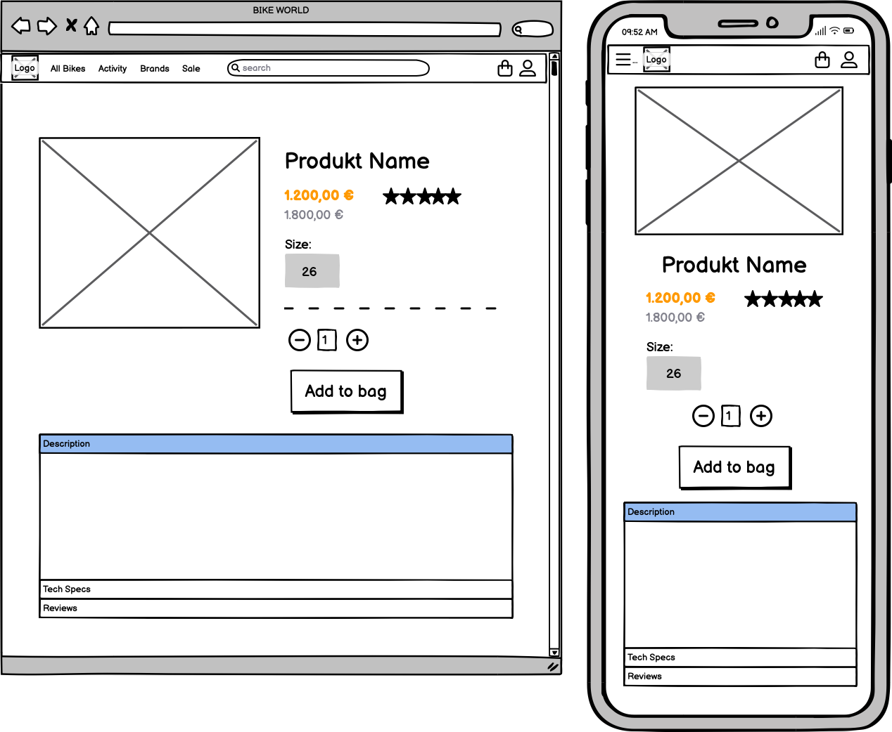

# BIKE WORLD
Welcome to **Bike World**! 

The ecommerce store offers a wide selection of top-quality mountain bikes, suitable for both beginners and seasoned riders.

At Bike World, we understand that mountain biking is not just a hobby, it's a passion. That's why we are committed to providing our customers with the best possible products and services. We carefully curate our selection of mountain bikes from trusted brands to ensure that our customers have access to the latest and greatest equipment.

Our user-friendly website allows you to browse our extensive collection of mountain bikes.

Please note that at this stage, **Bike World** is a fictitious store which has been created for the purposes of satisfying the requirements for the **Code Institute** Full Stack Development Course Project 5.

# Live Project

[View live project here](https://bike-world.herokuapp.com/)

## Contents

---
- [Target Audience](#target-audience)
- [Business Objectives](#business-objectives)
- [User Objectives](#user-objectives)
- [User Experience (UX)](#user-experience-ux)
    - [User Demographics](#user-demographics)
    - [User Requirements](#user-requirements)
    - [Site Map](#site-map)
    - [User Stories](#user-stories)
- [Design](#design)
    - [Colour Palette](#colour-palette)
    - [Fonts](#fonts)
    - [Images](#images)
    - [Wireframes](#wireframes)
- [Agile methodology](#agile-methodology)
    - [MoSCoW method and story points](#moscow-method-and-story-points)
    - [Iterations](#iterations)
- [Database Model](#database-model)
    - [Database](#database)
    - [Entity Relationship Diagram](#entity-relationship-diagram)
    - [Models](#models)
- [Features](#features)
    - [Implemented Features](#implemented-features)
    - [Future Features](#future-features)
- [Marketing and Social Media](#marketing-and-social-media)
    - [User Group](#user-group)
    - [Online Platforms](#online-platforms)
    - [Social Media](#social-media)
    - [User Needs](#user-needs)
    - [Promotions](#promotions)
    - [Budget](#budget)
    - [Facebook Business Page](#facebook-business-page)
    - [Mailchimp](#mailchimp)
- [Privacy Policy](#privacy-policy)
- [Search Engine Optimization](#search-engine-optimization)
    - [sitemap.xml](#sitemapxml)
    - [robots.txt](#robotstxt)
    - [Sitemap Google Registration](#sitemap-google-registration)
    - [Googel Search Snippets](#google-search-snippets)
- [AWS Setup Process](#aws-setup-process)
    - [AWS S3 Bucket](#aws-s3-bucket)
    - [IAM Set Up](#iam-set-up)
    - [Connecting AWS to the Project](#connecting-aws-to-the-project)
- [Stripe Payments](#stripe-payments)
    - [Payments](#payments)
    - [Webhooks](#webhooks)
- [Technologies Used](#technologies-used)
    - [Languages](#languages)
    - [Framework](#framework)
    - [Programs](#programs)
- [Testing](#testing)
- [Deployment](#deployment)
- [References & Credit](#references-credit)

---

# <a name="target-audience">Target Audience</a>
The target audience for **Bike World** are mountain biking enthusiasts of all ages and experience levels. **Bike World** appeals to a wide range of customers, from beginners who are just starting out in the sport, to experienced riders who demand the latest and greatest equipment. **Bike World** understands that mountain biking is more than just a hobby, it's a lifestyle, and **Bike World** aims to provide a platform where like-minded individuals can come together and find the best equipment to support their passion.

# <a name="business-objectives">Business Objectives</a>
The primary business objective is to provide customers with a comprehensive online platform for purchasing top-quality mountain bikes. **Bike World** strives to offer a diverse selection of bikes from trusted brands, at competitive prices, with the convenience of online shopping. The goal is to establish **Bike World** as a leading ecommerce store for mountain bikes, with a reputation for excellent customer service and a commitment to providing the latest and greatest equipment. **Bike World** is committed to provid customers with an intuitive and enjoyable shopping experience. The website is designed with a user-friendly interface that is easy to navigate, with clear categories and filters that allow customers to quickly find the products they are looking for. 

# <a name="user-objectives">User Objectives</a>
The primary user objectives are to provide a wide range of high-quality mountain bikes at competitive prices, with a user-friendly online shopping experience. **Bike World** strives to offer customers the convenience of online shopping with the added benefit of expert product knowledge and exceptional customer service. Additionally, **Bike World** provides customers with access to detailed product information and reviews to help them make informed decisions about their purchase.

# <a name="user-experience-ux">User Experience (UX)</a>

## <a name="user-demographics">User Demographics</a>
The user demographics for Bike World are diverse, as mountain biking is a sport enjoyed by people of all ages and backgrounds. However, the primary target audience consists of males and females between the ages of 18 and 45 who are passionate about mountain biking. Bike World also caters to beginners who are just starting out in the sport, as well as experienced riders who are looking for the latest and greatest equipment.

## <a name="user-requirements">User Requirements</a>
Bike World customers require a comprehensive selection of high-quality mountain bikes, ranging from entry-level to premium models, with detailed product information and competitive pricing. We also recognize the importance of customer service and support, providing responsive and knowledgeable assistance to answer any questions or concerns. Additionally, customers require a secure and easy-to-use online platform, with a streamlined checkout process. To enhance the user experience, Bike World understands the importance of providing a wishlist feature to save products for later purchase and an intuitive platform that is easy to navigate.

## <a name="site-map">Site Map</a>

## <a name="user-stories">User Stories</a>

- As a site user,
  - [#9](https://github.com/kerstin-w/Bike-World/issues/9) I want to navigate to the landing page firstly so that I can see what the store is about
  - [#10](https://github.com/kerstin-w/Bike-World/issues/10) I can navigate through the site from the navbar so that it is easy to access the key components of the site
  - [#14](https://github.com/kerstin-w/Bike-World/issues/14) I can search for a product by a keyword so that I can find products relative to the keyword
  - [#15](https://github.com/kerstin-w/Bike-World/issues/15) I can create an account so that sign in and make use of the site full functionality
  - [#18](https://github.com/kerstin-w/Bike-World/issues/18) I can log in with my social media accounts so that it is very easy to create an account to use the site
  - [#20](https://github.com/kerstin-w/Bike-World/issues/20) I can See a list of products with the ability to click on each item for more information so that I can make informed purchases.
  - [#21](https://github.com/kerstin-w/Bike-World/issues/21) I can select a certain segment so that I can only view relevant products
  - [#22](https://github.com/kerstin-w/Bike-World/issues/22) I can sort and filter products so that I can see relevant products to purchase and make a better decision
  - [#23](https://github.com/kerstin-w/Bike-World/issues/23) I can add products to my cart so that can review my selected products and make a purchase
  - [#24](https://github.com/kerstin-w/Bike-World/issues/24) I can view my shopping cart so that I have an overview of the items I want to purchase
  - [#25](https://github.com/kerstin-w/Bike-World/issues/25) I can adjust the quantity of a product in my cart so that purchase the quantity I desire
  - [#26](https://github.com/kerstin-w/Bike-World/issues/26) I can delete products from my cart so that I don't have to purchase the product in case I changed my mind
  - [#27](https://github.com/kerstin-w/Bike-World/issues/27) I am always informed about actions I take so that I am assured they were successful or receive supportive information in case of an error
  - [#28](https://github.com/kerstin-w/Bike-World/issues/28) I am redirected to a checkout page so that I can make a purchase
  - [#29](https://github.com/kerstin-w/Bike-World/issues/29) I can see a confirmation of my purchase so that I am assured the purchase was successful
  - [#32](https://github.com/kerstin-w/Bike-World/issues/32) I can Sign Up for the newsletter so that I can keep up to date with deals and events
  - [#33](https://github.com/kerstin-w/Bike-World/issues/33) I can see an option to get in contact with the shop so that reach out for support
  - [#34](https://github.com/kerstin-w/Bike-World/issues/34) I can find answers to frequently asked questions easily so that I can quickly resolve my queries
  - [#35](https://github.com/kerstin-w/Bike-World/issues/35) I can view reviews of products on the online store so that I can make an informed decision before making a purchase
  - [#37](https://github.com/kerstin-w/Bike-World/issues/37) I can receive a discount code when I sign up for the newsletter so that I can use it towards my first
  - [#38](https://github.com/kerstin-w/Bike-World/issues/38) I can easily apply my discount code to my purchase so that I can receive the discount
  - [#42](https://github.com/kerstin-w/Bike-World/issues/42) I can be routed to a error page in case a page is not found so that I understand the error and click on a link to get back to the homepage

 

- As a registered user,
    - [#16](https://github.com/kerstin-w/Bike-World/issues/16) I can log in and out so that so that I can protect my account and use the sites full functionality
    - [#17](https://github.com/kerstin-w/Bike-World/issues/17) I can reset my password so that I can always access my account and my account stays secure
    - [#19](https://github.com/kerstin-w/Bike-World/issues/19) I can a welcome email so that I am assured that my account was created successfully
    - [#30](https://github.com/kerstin-w/Bike-World/issues/30) I can edit my account so that personal data stays up to date
    - [#31](https://github.com/kerstin-w/Bike-World/issues/31) I can delete my account so that I can remove my footprint from the website if I am no longer useing it
    - [#36](https://github.com/kerstin-w/Bike-World/issues/36) I can leave a review for a product I have purchased so that I can share my experience with others
    - [#39](https://github.com/kerstin-w/Bike-World/issues/39) I can create and add products to my wishlist so that I can keep track of products that I am interested in and plan future purchases more easily
    - [#40](https://github.com/kerstin-w/Bike-World/issues/40) I can see related products on the product detail page (PDP) so that I can easily discover alternative products

 

- As a Superuser,
    - [#11](https://github.com/kerstin-w/Bike-World/issues/11) I can add a new product to the database so that I can expand my assortment
    - [#12](https://github.com/kerstin-w/Bike-World/issues/12) I can Edit products so that I can keep all information updated
    - [#13](https://github.com/kerstin-w/Bike-World/issues/13) I can delete products from the database so that remove obsolete products
    - [#41](https://github.com/kerstin-w/Bike-World/issues/41) I can have a dashbaord in the admin panel so that I can view and manage key metrics

 

- As a store owner,
    - [#43](https://github.com/kerstin-w/Bike-World/issues/43) I want to create a sitemap and robots.txt file for my website so that search engines can properly index and crawl my pages
    - [#44](https://github.com/kerstin-w/Bike-World/issues/44) I want to create a Facebook page for my e-commerce business so that I can increase visibility and engage with customers
    - [#45](https://github.com/kerstin-w/Bike-World/issues/45) I want to quickly understand, how the page works. I need the README file to provide clear and concise instructions and documentation.

 

# <a name="design">Design</a>

## <a name="colour-palette">Colour Palette</a>

To create a simple design that does not distract customers from the essential areas, only few colors are used.  White is used as the main background color, which creates a clear and bright design. 
The font is predominantly black, which creates a good contrast and is easily readable for customers. 
Certain areas and segments have a  light gray color to highlight and accentuate them. This provides a subtle contrast to the predominantly white background and draws attention to important elements of the design. 
An  orange color has been chosen for all call-to-action buttons and promotional/sale segments. This color stands out and grabs the user's attention, as Bike World wants to guide the customer to the checkout and purchase process as easily as possible. The orange color creates a sense of urgency and encourages the user to take action. By using this color, Bike World aims to optimize the user experience, drive sales and reduce the abondend cart rate.

After testing the accessibility, the inital orange was changed to a darker orange to achieve a better contrast between the orange background and the white text from buttons.

## <a name="fonts">Fonts</a>
[_Sourced via Google Fonts._](https://fonts.google.com/)

Using a consistent font throughout a website is important for creating a cohesive and easy-to-use experience for the user. This is why **Roboto** was choosen as font for Bike world.
Roboto is a versatile sans-serif font that was designed by Google in 2011 specifically for use on the Android operating system. Roboto has a clean and modern appearance, legibility, and versatility. Roboto is designed to be easily legible at various sizes, making it a great choice for both body text and headings. Its clean lines and open letterforms make it easy to read on both small screens and large displays.
Overall, using a consistent font helps to create a polished and professional look for Bike World, while also improving the user experience by providing clear and easy-to-read text.

## <a name="images">Images</a> 

[*Sourced via Pexels.*](https://www.pexels.com/)

In an online shop, images are an essential element of the user experience. They provide visual cues and help users understand what the products look like in real life. In my shop, I have used images in the hero banner and category callouts to showcase the bikes in action. The hero banner is the first thing that users see when they arrive on the site. By using an image that shows a bike in action, users can quickly understand the main purpose of the site and the type of products that are being sold. This helps to create an emotional connection with the user and encourages them to explore the site further. Similarly, the category callouts use images to showcase the different types of bikes that are available. By showing the bikes in action, users can understand how they might use the bikes in their own lives. This helps to make the products more relatable and can encourage users to make a purchase.
Product images from the [**Kegel**](https://www.kaggle.com/datasets/tysonpo/bike-ads-images-prices-specifications?select=data_bike_exchange.json) data set were used for the PDPs. Improvements are still desirable in this regard. In an ideal scenario, there would be several pictures of the bike with detail shots. The format would be webp and the quality a slightly better so that a zoom could also be built in. 

## <a name="wireframes">Wireframes</a> 

    
Homepage

    

    
CLP (Category Landing Page)

    

    
PDP (Product Landing Page)

    

    
Shopping Bag

    

    
Checkout

    

    
Checkout Success

    

    
Profile

    

    
Add/Edit Product

    

# <a name="agile-methodology">Agile methodology</a>

All functionality and development of this project were managed using GitHub which Projects can be found
[here](https://github.com/users/kerstin-w/projects/7)

## <a name="moscow-method-and-story-points">MoSCoW method and story points</a>

To implement agile methodology, the Kanban board and Issues feature on GitHub Projects were utilized. 
8 Epics were created which were then further developed into User Stories. User stories were first created and then prioritized using the MoSCoW method. The points were assigned to each story based on their complexity, amount of work, and repetition using a modified Fibonacci sequence (1, 2, 3, 5, and so on). Each User Story was assigned a classification of `Must Have`, `Should Have`, `Could Have` or `Won't Have` and re-evaluated in each Iteration.  In practice, some of the User Stories were completed quicker than anticipated and other User Stories took longer.

[One EPIC](https://github.com/kerstin-w/Bike-World/issues/7) and two User Stories ([#37](https://github.com/kerstin-w/Bike-World/issues/37), [#38](https://github.com/kerstin-w/Bike-World/issues/38)) were not completed at all. This feature was a `Could Have` from the beginning. I put some thought into the implementation of this feature, but due to its complexity I decided to use the remaining time to improve the features I had and overall user experience, instead of adding another feature. Read more in [Future Features](#future-features).

The details are as follows:

- [EPIC: Landing Page](https://github.com/kerstin-w/Bike-World/issues/1)

    | Issue # | User Story | Prioritisation | Points |
    | :-----------: | :---------: | :-----------: | :-----------: |
    | [#9](https://github.com/kerstin-w/Bike-World/issues/9) | As a Site User I want to navigate to the landing page firstly so that I can see what the store is about | Must Have | 4 |
    | [#10](https://github.com/kerstin-w/Bike-World/issues/10) | As a Site User I can navigate through the site from the navbar so that it is easy to access the key components of the site | Must Have | 2 |
    | [#14](https://github.com/kerstin-w/Bike-World/issues/14) | As a Unregistered User I can select a category so that I can only view relevant posts. | Must Have | 2 |

 

- [EPIC: Create and View Products](https://github.com/kerstin-w/Bike-World/issues/2)

    | Issue # | User Story | Prioritisation | Points |
    | :-----------: | :---------: | :-----------: | :-----------: |
    | [#11](https://github.com/kerstin-w/Bike-World/issues/11) | As a Superuser I can add a new product to the database so that I can expand my assortment | Should Have | 3 |
    | [#12](https://github.com/kerstin-w/Bike-World/issues/12) | As a Superuser I can Edit products so that I can keep all information updated | Should Have | 3 |
    | [#13](https://github.com/kerstin-w/Bike-World/issues/13) | As a superuser I can delete products from the database so that remove obsolete products | Could Have | 2 |
    | [#14](https://github.com/kerstin-w/Bike-World/issues/14) | As a Site User I can search for a product by a keyword so that I can find products relative to the keyword | Must Have | 2 |
    | [#21](https://github.com/kerstin-w/Bike-World/issues/21) | As a Site User I can select a certain segment so that I can only view relevant products | Could Have | 1 |
    | [#22](https://github.com/kerstin-w/Bike-World/issues/22) | As a Site user I can sort and filter products so that I can see relevant products to purchase and make a better decision | Should Have | 4 |

 

- [EPIC: User Profile](https://github.com/kerstin-w/Bike-World/issues/3)

    | Issue # | User Story | Prioritisation | Points |
    | :-----------: | :---------: | :-----------: | :-----------: |
    | [#15](https://github.com/kerstin-w/Bike-World/issues/15) | As a Site User I can create an account so that sign in and make use of the site full functionality | Could Have | 3 |
    | [#16](https://github.com/kerstin-w/Bike-World/issues/16) | As a registered user I can log in and out so that so that I can protect my account and use the sites full functionality | Must Have | 3 |
    | [#17](https://github.com/kerstin-w/Bike-World/issues/17) | As a registered user I can reset my password so that I can always access my account and my account stays secure | Could Have | 2 |
    | [#18](https://github.com/kerstin-w/Bike-World/issues/18) | As a Site User I can log in with my social media accounts so that it is very easy to create an account to use the site | Must Have | 3 |
    | [#19](https://github.com/kerstin-w/Bike-World/issues/19) | As a Registered User I can a welcome email so that I am assured that my account was created successfully | Must Have | 2 |
    | [#30](https://github.com/kerstin-w/Bike-World/issues/30) | As a Registered User I can edit my account so that personal data stays up to date | Must Have | 3 |
    | [#31](https://github.com/kerstin-w/Bike-World/issues/31) | As a Registered User I can delete my account so that I can remove my footprint from the website if I am no longer useing it | Must Have | 2 |

 

- [EPIC: Shopping Cart and Checkout](https://github.com/kerstin-w/Bike-World/issues/4)

    | Issue # | User Story | Prioritisation | Points |
    | :-----------: | :---------: | :-----------: | :-----------: |
    | [#20](https://github.com/kerstin-w/Bike-World/issues/20) | As a Site User I can See a list of products with the ability to click on each item for more information so that I can make informed purchases. | Must Have | 3 |
    | [#23](https://github.com/kerstin-w/Bike-World/issues/23) | As a Site User I can add products to my cart so that can review my selected products and make a purchase | Could Have | 4 |
    | [#24](https://github.com/kerstin-w/Bike-World/issues/24) | As a Site User I can view my shopping cart so that I have an overview of the items I want to purchase | Must Have | 4 |
    | [#25](https://github.com/kerstin-w/Bike-World/issues/25) | As a Site User I can adjust the quantity of a product in my cart so that purchase the quantity I desire | Must Have | 2 |
    | [#26](https://github.com/kerstin-w/Bike-World/issues/26) | As a Site User I can delete products from my cart so that I don't have to purchase the product in case I changed my mind | Must Have | 2 |
    | [#28](https://github.com/kerstin-w/Bike-World/issues/28) | As a Site User I am redirected to a checkout page so that I can make a purchase | Could Have | 6 |
    | [#29](https://github.com/kerstin-w/Bike-World/issues/29) | As a Site User I can see a confirmation of my purchase so that I am assured the purchase was successful | Must Have | 2 |

 

- [EPIC: User Feedback](https://github.com/kerstin-w/Bike-World/issues/5)

    | Issue # | User Story | Prioritisation | Points |
    | :-----------: | :---------: | :-----------: | :-----------: |
    | [#27](https://github.com/kerstin-w/Bike-World/issues/27) | As a Site User I am always informed about actions I take so that I am assured they were successful or receive supportive information in case of an error | Should Have | 3 |

 

- [EPIC: Customer Review](https://github.com/kerstin-w/Bike-World/issues/6)

    | Issue # | User Story | Prioritisation | Points |
    | :-----------: | :---------: | :-----------: | :-----------: |
    | [#35](https://github.com/kerstin-w/Bike-World/issues/35) | As a Site User I can view reviews of products on the online store so that I can make an informed decision before making a purchase | Could Have | 2 |
    | [#36](https://github.com/kerstin-w/Bike-World/issues/36) | As a registered user I can leave a review for a product I have purchased so that I can share my experience with others | Could Have | 4 |

 

- [EPIC: Discount Code](https://github.com/kerstin-w/Bike-World/issues/7)

    | Issue # | User Story | Prioritisation | Points |
    | :-----------: | :---------: | :-----------: | :-----------: |
    | [#37](https://github.com/kerstin-w/Bike-World/issues/37) | As a site user I can receive a discount code when I sign up for the newsletter so that I can use it towards my first purchase | Will Not Have | 1 |
    | [#38](https://github.com/kerstin-w/Bike-World/issues/38) | As a Site user I can easily apply my discount code to my purchase so that I can receive the discount | Will Not Have | 5 |

 

- [EPIC: Wishlist](https://github.com/kerstin-w/Bike-World/issues/8)

    | Issue # | User Story | Prioritisation | Points |
    | :-----------: | :---------: | :-----------: | :-----------: |
    | [#39](https://github.com/kerstin-w/Bike-World/issues/39) | As a registered user I can create and add products to my wishlist so that I can keep track of products that I am interested in and plan future purchases more easily | Must Have | 4 |

 

### <a name="iterations">Iterations</a>

The project was carried out over 4 iterations and each iteration lasted 7-8 days. For personal and professional reasons, I had only limited time for iterations 5 and 6, so few story points were awarded here. And between iteration 5 and 6, the story points for story #37 and #38 were adjusted as well due to the complexity becoming known. 

- **Iteration 1 (Closed points 20 / Planned points 20)**

    

- **Iteration 2 (Closed points 20 / Planned points 20)**

    

- **Iteration 3 (Closed points 20 / Planned points 20)**

    

- **Iteration 4 (Closed points 20 / Planned points 20)**

    

- **Iteration 5 (Closed points 12 / Planned points 9)**

    

- **Iteration 6 (Closed points 18 / Planned points 12)**

    

As already stated, two User Stories ([#37](https://github.com/kerstin-w/Bike-World/issues/37), [#38](https://github.com/kerstin-w/Bike-World/issues/38)) were not completed at all. They were first not closed in Iteration 5 and then pushed to Iteration 6, where they were also not closed. This feature was a `Could Have` from the beginning. I put some thought into the implementation of this feature, but due to its complexity I decided to use the remaining time to improve the features I had and overall user experience, instead of adding another feature. Read more in [Future Features](#future-features).

# <a name="marketing-and-social-media">Marketing and Social media</a>

## <a name="user-group">User Group</a>

As already mentioned in [Target Audience](#target-audience) the users of **Bike World** would primarily be individuals who are interested in purchasing high-class mountain bikes. They are likely to be cycling enthusiasts, outdoor adventurers, sports enthusiasts, and individuals who value quality and performance. They may range from beginners looking for their first mountain bike to experienced riders seeking top-of-the-line models.

## <a name="online-platforms">Online Platforms</a>

To reach a wide range of users, **Bike World** considers using various online platforms to reach the target audiance. Some potential platforms to target users are:
* **eCommerce Platform**: Creating a dedicated website for Bike World is essential. This allows users to browse and purchase bikes directly the store and connect with **Bike World**
* **Online marketplaces**: Listing products on popular marketplaces such as Amazon or eBay, can help you reach a broader audience.
* **Social Media**: Engaging with users on social media platforms can be highly effective. **Bike World** considers leveraging platforms such as Facebook, Instagram, Twitter, Strava and YouTube to showcase products, share relevant content, and interact with potential customers.
* **Cycling forums and communities**: Participating in online cycling forums, communities, and discussion boards can help establish a presence among the target audience. **Bike World** will provide valuable insights, answers questions, and shares information about products.

## <a name="social-media">Social Media</a>

Cyclists and outdoor enthusiasts are known to be active on social media platforms. The following platforms would be most relevant for **Bike World**:

* **Instagram**: Cyclists often share their biking experiences and post pictures of their rides on Instagram. This platform allows **Bike World**to visually showcase your products and engage with potential customers.
 

* **Facebook**: Facebook provides a broad user base, including cycling groups and communities. **Bike World** has create a [Business Page](#watches--clocks---facebook-page) to share updates, promotions, and engage with users through comments and messages. Facebook offers powerful advertising tools that allow businesses to target specific demographics, interests, and behaviors. **Bike World** can leverage these tools to reach individuals who have shown interest in cycling, outdoor activities, or related topics. By narrowing down the target audience, **Bike World** can ensure that its marketing efforts are more focused and effective. Facebook allows businesses to run promotions, contests, and offer exclusive discounts to their audience. **Bike World** can leverage this feature to announce sales, launch new products, or reward loyal customers. The ability to target these promotions to a specific audience ensures that the offers are seen by individuals who are more likely to be interested in purchasing mountain bikes.
 

* **Strava**: Strava is a popular social fitness platform specifically designed for cyclists and runners. By being present on Strava, **Bike World** can directly target a community of active cyclists who are passionate about their sport and likely to be interested in high-class mountain bikes. This focused audience ensures that marketing efforts reach individuals who are already engaged in the cycling community. Strava fosters a sense of community among its users, allowing cyclists to connect, share their activities, and engage with one another. **Bike World** can tap into this community and actively participate in discussions, offer insights, and showcase  products. This helps in building brand awareness, fostering loyalty, and creating a positive brand image among dedicated cyclists. Strava also allows users to add and showcase the gear they use, including bikes. By encouraging **Bike World** customers to add their purchased bikes to their Strava profiles, **Bike World** can effectively showcase products to a wider audience. Additionally, positive reviews and endorsements from Strava users can serve as powerful social proof, influencing potential customers' purchasing decisions.
 

* **YouTube**: YouTube is an excellent platform for sharing informative videos related to biking, maintenance tips, trail guides, and showcasing the features of different mountain bikes. YouTube is a popular platform for product demonstrations and reviews. **Bike Worl**d** can create videos showcasing the performance, features, and benefits of its high-class mountain bikes. Detailed reviews by experts or influencers within the cycling community can help potential customers make informed purchasing decisions. Positive reviews and testimonials can also serve as powerful social proof, further enhancing the credibility and desirability of Bike World's products.

## <a name="user-needs">User Needs</a>

Bike World's users primarily need high-class mountain bikes and related information to support their cycling endeavors. They want to explore various options, compare specifications, and make informed decisions before purchasing. **Bike World** addressed this need by providing comprehensive product catalogs, detailed descriptions and images. A user-friendly website navigation and intuitive search functions also make it easier for users to find the specific mountain bike models they are interested in. Users often seek expert advice and recommendations when it comes to purchasing mountain bikes. **Bike World** meets this need by providing reviews and in the future buyer's guides, and comparisons that help users understand the strengths and weaknesses of different bikes, as well as the suitability for various terrains and riding styles. Users also value the opinions and experiences of fellow cyclists. Therefore, positive reviews and authentic user experiences serve as social proof and influence potential customers' perceptions and purchasing decisions. Encouraging customers to share their experiences and engage with the brand through hashtags, messages, contests, or sharing features can help create a sense of community and encourage user-generated content.

By providing useful content, **Bike World** can meet their needs and establish itself as a valuable resource in the cycling community. Here's how **Bike World** will deliver content effectively:

* **Blog Articles**: Content is King and therefore Bike World plans to maintain a blog on the website where we regularly publishes informative articles. These articles will cover a wide range of topics, including bike maintenance tips, trail guides, fitness advice, gear reviews, and cycling event updates. By addressing common questions and providing valuable insights, Bike World will establish expertise and offer practical solutions to users' needs.
* **Video Tutorials**: Creating video tutorials and guides can be an engaging way to deliver useful content. **Bike World** plans to produce videos demonstrating bike assembly, maintenance techniques, trail navigation, and cycling skills. These videos will be shared on platforms like YouTube, embedded on the website's blog articles, and promoted through social media channels to reach a wider audience.
* **Social Media Engagement**: **Bike World** will actively engage with users on social media platforms such as Facebook, Instagram, and Strava. By sharing short tips, quick hacks, motivational content, and updates on the latest biking trends, **Bike World** will deliver bite-sized and valuable content directly to the users' social media feeds. This helps maintain an ongoing connection and encourages users to interact and share the content with their networks.
* **Email Newsletters**: Bike World offers a newsletter subscription option on the website. Users who signup will receive regular newsletters featuring curated content, exclusive offers, product updates, and relevant industry news. By leveraging email marketing, **Bike World** will provide tailored content directly to users' inboxes, keeping them informed and engaged.

## <a name="promotions">Promotions</a>
**Bike World** has already established a sales segment and plans to run more seasonal sales in the future. Bike World does not aim to be known for low prices only, but low prices are also important to get in touch with a more price-conscious user group. In addition, sales can be used to sell overstock. Bike World plans to introduce discount promotions with discount codes in the future, which will either be sent exclusively to newsletter subscribers, sent through social media channels or will be visible on the website. It is importent to consider the most effective channels for reaching the target audience to inform users about sales and discount codes. 

* **Emails**: Bike World utilize newsletters to notify subscribers about upcoming sales and exclusive discount codes. This allows Bike World to reach users directly in their inboxes, providing personalized offers and building a sense of exclusivity.
* **Social Media**: Bike world will use social media platforms like Facebook and Instagram to announce sales and discounts. Bike World will create engaging posts and stories to generate excitement and encourage users to take advantage of the promotional offers. By leveraging the reach and sharing capabilities of social media, Bike World can potentially reach a broader audience and benefit from viral sharing.
* **Ad Campaigns**: In the beginning Bike World has fairly small marketing budget but will allocate a large portion of the budget to online advertising campaigns to target users who are likely to be interested in mountain biking. Bike World plans on spending budget into display ads and search ads which can be utilized to promote the sales and discounts. This ensures that Bike World reaches users actively searching for relevant products or browsing related content.

## <a name="Budget">Budget</a>
**Bike World** has a limited marketing budget at the beginning and therefore has to be very selective and choose the most efficient low-cost marketing options. This is also why Bike World will leverage social media platforms to build brand awareness and engage with the target audience. Bike World will develope a content strategy entered around creating high-quality, informative, and engaging content related to mountain biking. This will include a blog, how-to-videos and video tutorials. By providing valuable content that resonates with your audience, Bike World will attract organic traffic to the website, establish credibility, and foster customer loyalty. Bike world is continuously conducting keyword research to understand the terms and phrases your target audience is searching for and to incerase organic traffic. Email Marketing is very cost-efficient and will be used to nurture customer relationships and drive sales.

## <a name="facebook-business-page">Facebook Business Page</a>

Market research was undertaken to decide on the appropriate marketing strategy to promote Bike World. For social media marketing, Facebook is still the best option to promote brands to potential customers. It is one of the most used social media platforms with for users aged between 18 - 24 and users aged between 25 - 34 and very populare by male user. These categories are the main target audience for Bike World.

Therefore a facebook business page has been created to share updates, promotions, and engage with users through comments and messages. On the Facebook business page a "Buy Now" (Jetzt Kaufen) button has been set up which leads users directly to the Shop and interesting posts have already been shared.

Unfortunately, it was not possible to create an ad for the webshop already, as this is chargeable. However, here is a preview of the potential ad.

In order to improve the website services, I have set a Meta Pixel service to track the Bike World audience. This will be especially relevant for future Facebook campaigns to track the success.

# <a name="privacy-policy">Privacy Policy</a>

## Privacy Policy

In order to add a page with Bike World´s Privacy Policy I used the service [Privacy Policy Generator](https://www.privacypolicygenerator.info/) to ensure 
that the website is compliant with the European Privacy Policy Rules.

Privacy Policy

# <a name="search-engine-optimization">Search Engine Optimization</a>

A detailed keyword selection was performed around mountain bike. All key words are important and relevant in relation to the topic mountain bike and store. The chosen keywords stem from the understanding of the business. The chosen keywords are common terms and topics around the mountain bike and outdoor industry. The keywords were tested with [Wordtracker](https://www.wordtracker.com/) for their volume and competition. Crossed out keywords were removed because either the volume was too low or the competition was too high. The keywords were included in the meta tag key words. In meta description one long-tail keyword was used and the rest of the keywords were tried to be distributed naturally on the page. 

## <a name="sitemapxml">Sitemap.XML</a>

With the help of [XML-Sitemaps.com](https://www.xml-sitemaps.com/), a site map was created for Bike World, which includes all relevant pages. The sitemap was downloaded and added to the root directory. To ensure that Google and other services indeed have access to the sitemap, it was added as `TemplateView` to the urls. For this the [sitemap](templates/sitemap.xml) was moved to the templates folder.

## <a name="robotstxt">robots.txt</a>

A robots.txt was created to allow crawlers to crawl the page and also to specify which pages should not be crawled. This of course has a beneficial impact on the SEO rating. However, so that crawlers can really use the robots.txt, a view was created and included in the urls. The robots.txt file was saved in the roots directory, as it was a requirement for this project, but it is not in actual use, as the view sets the parameters for the crawler. As a resource [this](https://adamj.eu/tech/2020/02/10/robots-txt/) acrticle has been used. 

## <a name="sitemap-google-registration">Sitemap Google Registration</a>

The Bike World page has been verified in **Google Search Console**. For this it was necessary to include a `meta tag` in the head. 

After that, the sitemap was submitted to Google Search Console to ensure that the search engine can interact with our site.

(I apologize for the german screenshots, but my google account is set to german.)

## <a name="google-search-snippets">Google Search Snippets</a>

In addition, the Google Search Snippets were tested in order to appear relevant and engaging for the users among the search results. These use the page `title` and the `meta description` and are limited on characters. These snippets are currently only outstanding for the homepage but not for subpages. I attempted to set an automation in the template at least for the PDPs in order to use the first sentence of the product description as meta description on PDPs. This was unfortunately not fruitful and would not have been the ideal solution, because the maximum number of characters can not be controlled and also no optimization with keyword can be taken yet. Therefore I have taken this out again. It exceeds the scope of this project, but there is still potential for optimization.

[Created with SISTRIX:](https://app.sistrix.com/en/serp-snippet-generator)

## <a name="mailchimp">Mailchimp</a>

Newsletters are still an important marketing tool and relatively cost-effective. Therefore Bike World has integrated a newsletter signup from MailChimp on the site. It is important for Bike World to grow the subscriber base quickly for reaching more users. But not at any price. Thus it was decided to not integrate a pop up for the newsletter signup on the homepage in the sense of an excellent and positive user experience. This would naturally bring far more users to sign up for the newsletter. However, a pop up is just irritating for many users and leads to a higher bounce rate. As a result, a signup was added to the footer where users can sign up for a newsletter. The newsletter signup will also be promoted via Facebook in the future and as soon as the coupon code feature is implemented, a 10€ discount code will be offered as an incentive. The email subscription service is run through Mailchimp, allowing the website admin to send marketing emails through the platform, increasing engagement within the site.

Unfortunately it was not possible to configure an automatic welcome email for all subscribers in Mail Chimp without paying. However, below is a draft of its possible appearance. 

## <a name="testing">Testing</a>

See [TESTING.md](TESTING.md) for an overview of website testing and debugging.