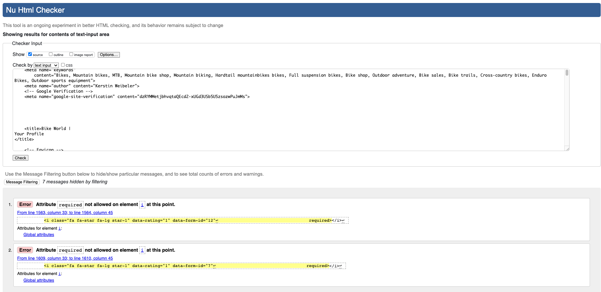

# Testing

## Contents

- [Manual Testing](#manual-testing)
- [Automated Testing](#automated-testing)
- [User Stories Testing](#user-stories-testing)
- [Validator Testing](#validator-testing)
  - [HTML](#html)
  - [CSS](#css)
  - [JS](#js)
  - [Python](#python)
- [Performance Testing](#performance-testing)
  - [Desktop Results](#desktop-results)
  - [Mobile Results](#mobile-results)
- [Browser Compatibility](#browser-compatibility)
- [Responsivity](#responsivity)
- [Issues/ Bugs Found & Resolved](#issues-bugs)
- [Unresolved](#unresolved)

---
Back to the [README](README.md) 

## <a name="manual-testing">Manual Testing</a>

## <a name="automated-testing">Automated Testing</a>

Python **Automated Unit Testing** was implemented using the [Django Unit Testing](https://docs.djangoproject.com/en/3.2/topics/testing/overview/) framework.  
**Unit Tests** have been written to cover all major parts of the code like **Forms**, **Models**, **Views**, **Admin**, **Context-Processors** and **Fields**. The tests were created to cover all key aspects of the code. Only the checkout app has a moderate coverage, but here manual testing was applied.
A total of **226** **Unit Tests** have been written. All **226** tests ran successfully without errors or warnings.   

    
Coverage Automated Testing

    
    
    

 

## <a name="user-stories-testing">User Stories Testing</a>

## <a name="validator-testing">Validator Testing</a>

### <a name="html">HTML</a>
All **HTML** code was validated using the [W3C Markup Validation Service](https://validator.w3.org/) regularly during the development process. **The HTML Source Code** was regularly viewed for each page using **Google Chrome** and passed through the [W3C Markup Validation Service](https://validator.w3.org/). Various minor errors were encountered and corrected during the final **HTML** validation check.
A slightly unpleasant error was the duplicate of the `div_id_email` that occurred in the checkout. Crispy Forms creates a wrapper DIV around the input element and assigns the DIV ID `div_id_email` for email. Since I have two forms on the page with email, one being the `OrderForm` and the other being the `login/signup modal`, there was a conflict here. I haven't found a really convinient solution to control the ID of the wrapper DIV with the existing OrderForm setup. One solution would have been to create the OrderForm entirely new with the `Crispy Form Helpers and Layout`. This would have given me the possibility to give the wrapper DIV its own ID. The other option would have been to manually create this input field in the HTML code. This is the solution I chose in the end, as it was less invasive. 

### Errors during validation check

    
Home Page

    

    
CLP

    

    
Checkout

    

    
Profile

    

### <a name="css">CSS</a>
### <a name="js">JavaScript</a>
### <a name="Python">Python</a>

## <a name="performance-testing">Performance Testing</a>

### <a name="desktop-results">Desktop Results</a>
### <a name="mobile-results">Mobile Results</a>

## <a name="browser-compatibility">Browser Compatibility</a>

## <a name="responsivity">Responsivity</a>

## <a name="issues-bugs">Issues/ Bugs Found & Resolved</a>