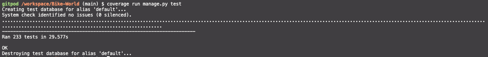
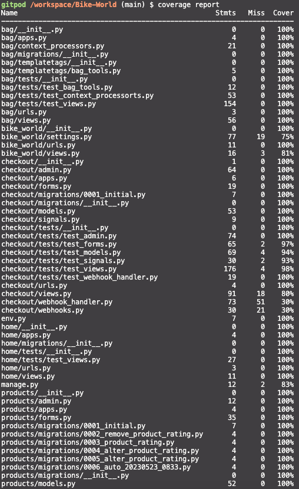

# Testing

## Contents

- [Manual Testing](#manual-testing)
- [Automated Testing](#automated-testing)
- [User Stories Testing](#user-stories-testing)
- [Validator Testing](#validator-testing)
  - [HTML](#html)
  - [CSS](#css)
  - [JS](#js)
  - [Python](#python)
- [Performance Testing](#performance-testing)
  - [Desktop Results](#desktop-results)
  - [Mobile Results](#mobile-results)
- [Browser Compatibility](#browser-compatibility)
- [Responsivity](#responsivity)
- [Issues/ Bugs Found & Resolved](#issues-bugs)
- [Unresolved](#unresolved)

---
Back to the [README](README.md)<br>

## <a name="manual-testing">Manual Testing</a>

## <a name="automated-testing">Automated Testing</a>

Python **Automated Unit Testing** was implemented using the [Django Unit Testing](https://docs.djangoproject.com/en/3.2/topics/testing/overview/) framework.  
**Unit Tests** have been written to cover all major parts of the code like **Forms**, **Models**, **Views**, **Admin**, **Context-Processors** and **Fields**. The tests were created to cover all key aspects of the code. Only the checkout app has a moderate coverage, but here manual testing was applied.
A total of **228** **Unit Tests** have been written. All **228** tests ran successfully without errors or warnings.   

<details>
    <summary>Coverage Automated Testing</summary>
    
    
    
</details>

<br>

## <a name="user-stories-testing">User Stories Testing</a>

## <a name="validator-testing">Validator Testing</a>

### <a name="html">HTML</a>
All **HTML** code was validated using the [W3C Markup Validation Service](https://validator.w3.org/) regularly during the development process. **The HTML Source Code** was regularly viewed for each page using **Google Chrome** and passed through the [W3C Markup Validation Service](https://validator.w3.org/). Various minor errors were encountered and corrected during the final **HTML** validation check.

A slightly tricky error was the error to the auto-focus. For login/signup I created a modal that loads on all pages. This modal has two tabs: one tab for login and one tab for signup. Accordingly, two forms load in one modal and Crispy Froms automatically sets an auto-focus for each form. Thus I had more than one auto-focus on the page. I could have manipulated the DOM to enable auto-focus for only the from that is open and disable it otherwise. However, the form would still have been rendered with auto-focus and the test would have returned an error. In the tutoring support we came up with the idea to create a context processor that handles the tags for signup and login. For this I have created a `CustomLoginForm` which disables the auto-focus. The context processor will then load the corresponding `CustomLoginForm` in the `logintag`

A slightly unpleasant error was the duplicate of the `div_id_email` that occurred in the checkout. Crispy Forms creates a wrapper DIV around the input element and assigns the DIV ID `div_id_email` for email. Since I have two forms on the page with email, one being the `OrderForm` and the other being the `login/signup modal`, there was a conflict here. I haven't found a really convinient solution to control the ID of the wrapper DIV with the existing OrderForm setup. One solution would have been to create the OrderForm entirely new with the `Crispy Form Helpers and Layout`. This would have given me the possibility to give the wrapper DIV its own ID. The other option would have been to manually create this input field in the HTML code. This was the solution I chose, as it was less invasive. Later on, I found the proper solution in the Django documentation. With the paramater `auto_id` I was able to control the Id of the wrapper DIV. I reversed the changes from before and the email field is rendered normally again and the DIV ID is now unique for the Login and Signup fields. 

### Errors during validation check

<details>
    <summary>Home Page</summary>
    
</details>
<details>
    <summary>CLP</summary>
    
</details>
<details>
    <summary>Shopping Bag</summary>
    
    
</details>
<details>
    <summary>Checkout</summary>
    
</details>
<details>
    <summary>Profile</summary>
    
    
</details>


### Results validation check

<details>
    <summary>Home Page</summary>
    
</details>
<details>
    <summary>CLP</summary>
    
</details>
<details>
    <summary>PDP</summary>
    
</details>
<details>
    <summary>Shopping Bag</summary>
    
</details>
<details>
    <summary>Checkout</summary>
    
</details>
<details>
    <summary>Profile</summary>
    
</details>
<details>
    <summary>Contact Us</summary>
    
</details>
<details>
    <summary>FAQs</summary>
    
</details>
<details>
    <summary>Return Policy</summary>
    
</details>
<details>
    <summary>PrivacyPolicy</summary>
    
</details>
<details>
    <summary>TCs</summary>
    
</details>


### <a name="css">CSS</a>

**Custom CSS Styling** from [admin.css](admin/static/admin/css/admin.css), [base.css](static/css/base.css), [bag.css](bag/static/bag/css/bag.css), 
[checkout.css](checkout/static/checkout/css/checkout.css), [products.css](products/static/products/css/products.css), [profiles.css](profiles/static/profiles/css/profiles.css) and [support.css](support/static/support/css/support.css).
was validated using the [W3C CSS Validation Service](https://jigsaw.w3.org/css-validator/).  
No errors were generated.

### Results

<details>
    <summary>Base.css</summary>
    
</details>
<details>
    <summary>Admin.css</summary>
    
</details>
<details>
    <summary>Bag.css</summary>
    
</details>
<details>
    <summary>Checkout.css</summary>
    
</details>
<details>
    <summary>Products.css</summary>
    
</details>
<details>
    <summary>Profiles.css</summary>
    
</details>
<details>
    <summary>Support.css</summary>
    
</details>
<details>
    <summary>quantity_input.css</summary>
    
</details>

### <a name="js">JavaScript</a>

The custom scripts, were validated using the [JSHint](https://jshint.com/about/) static code analysis tool. Due to the lack of complexity of **JavaScript** code implemented on the project, **Automated Unit Testing** of the **JavaScript** code was considered unnecessary. All **JavaScript** functions and event handlers in the custom **JavaScript Code Libraries** have been thoroughly manually debugged and tested in the console.

In checkout a warning was displayed that the variable Stripe is undefined. However, this is defined by the Stripe JS and therefore this message was not pursued further.

### Results

<details>
    <summary>Bag</summary>
    
</details>
<details>
    <summary>Checkout</summary>
    
</details>
<details>
    <summary>Products</summary>
    
    
    
    
</details>
<details>
    <summary>Profiles</summary>
    
    
    
</details>
<br>


### <a name="Python">Python</a>

All **Python Code** was thoroughly de-bugged and tested at the command line during the development process, and has been validated 
using [Flake8](https://flake8.pycqa.org/). [flake8-django](https://pypi.org/project/flake8-django/) was also installed to assist with validation.  
**Flake8** was configured by creating a `setup.cfg` file in the root of the project, which contains the following settings:
```
[flake8]
exclude = */migrations/*.py, *__init__.py, *_pychache_*, .vscode, *settings.py*,
per-file-ignores = *apps.py:F401, *env.py:E501,
```
The settings exclude **django** migrations, `__init__.py`, `.vscode` and `_pychache_` files, as these are system generated files and do not need to be checked.  
*settings.py* (line too long) errors are ignored as it is not possible to shorten the affected lines of code without causing application errors.  
*env.py* (line too long) errors are ignored as it is not possible to shorten the affected lines of code without causing application errors.
*F401* (imported but unused) errors are ignored for *apps.py, as **Flake8** was generating an error on **Django** signals being imported but unused. 
Signals need to be imported into the **app** config files to ensure correct operation of the code.  

<details>
    <summary>Result</summary>
    
</details>

<br>

## <a name="performance-testing">Performance Testing</a>

Lighthouse was used (accessed through Developer Tools in Chrome) to analyzee for the following:

- Performance
- Accessibility
- Best practice
- SEO

To improve the score I converted all product pictures to webp, which resulted in slightly better performance scores.

On the **Shopping Bag** page the SEO score raised an issue related to the *Page is blocked from indexing* and *Links are not crawlable*. This related to the robots.txt and this page beeing disallowed to be crawled. 

On several pages for **mobile** the performance score raised issues related to Bootstrap and Heroku: *Eliminate render-blocking resources.* As Bootstrap and Heroku are not replaceable at this point, I have decided not to pursue any further. To further improve performance, consideration should be given in a **Future Development Phase** to optimising **Bootstrap** by only importing the required components. See this [Link](https://getbootstrap.com/docs/5.0/customize/optimize/) for further information. Another cause for the lower performance score on mobile is **unused JavaScript**. This is caused partly by **Stripe**. The Stripe script must be loaded on all pages, so that Stripe can fully track the activity of the users and make a valid fraud assessment. Therefore, this script cannot only be placed in the checkout but is loaded on all pages. The script for newsletters is also referenced, but this must also be available on all pages, as the newsletter signup is provided in the footer. Only the script which is loaded with the facebook pixel could have been removed. Since no actual facebook advertising measures are carried out yet, the facebook pixel is rather installed for demonsatration purposes, but has no added value for the page and could therefore be removed. However, I decided to leave it in for the completeness of the marketing part. The analysis also indicated that **HTTP/2** should be used. This needs to be setup on the server side. An attempt was made to set this up on Heroku. However, this feature does not seem to be supported by heroku yet. [Link](https://github.com/heroku/roadmap/issues/34)
I am conscious that PageSpeed is an important factor in eCommerce and a slow website quickly results in customers abandoning the site. The page has an acceptable PageSpeed on mobile and sufficient for the scope of this project. For a real-world project, however, the voice actions would have to be made here. 

### <a name="desktop-results">Desktop Results</a>

<details>
<summary>Homepage</summary>


</details>
<details>
<summary>CLP</summary>


</details>
<details>
<summary>PDP</summary>


</details>
<details>
<summary>Bag</summary>


</details>
<details>
<summary>Checkout</summary>


</details>
<details>
<summary>Profile</summary>


</details>
<details>
<summary>Contact Us</summary>


</details>
<details>
<summary>FAQs</summary>


</details>

### <a name="mobile-results">Mobile Results</a>

<details>
<summary>Homepage</summary>


</details>
<details>
<summary>CLP</summary>


</details>
<details>
<summary>PDP</summary>


</details>
<details>
<summary>Bag</summary>


</details>
<details>
<summary>Checkout</summary>


</details>
<details>
<summary>Profile</summary>


</details>
<details>
<summary>Contact Us</summary>


</details>
<details>
<summary>FAQs</summary>


</details>


## <a name="browser-compatibility">Browser Compatibility</a>

## <a name="responsivity">Responsivity</a>

## <a name="issues-bugs">Issues/ Bugs Found & Resolved</a>