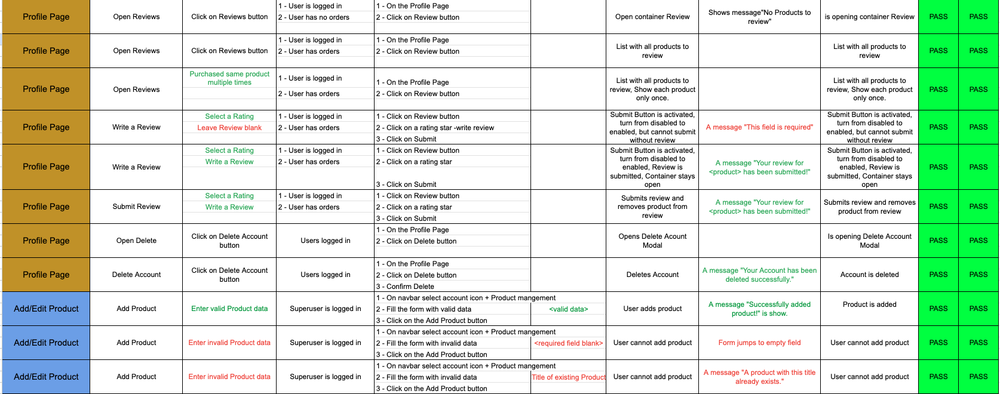
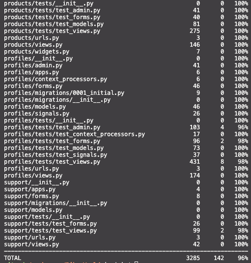
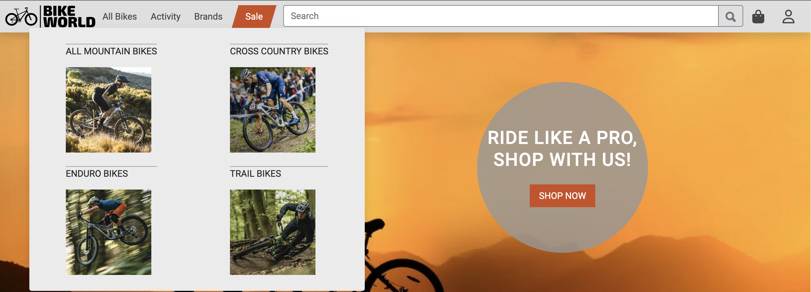
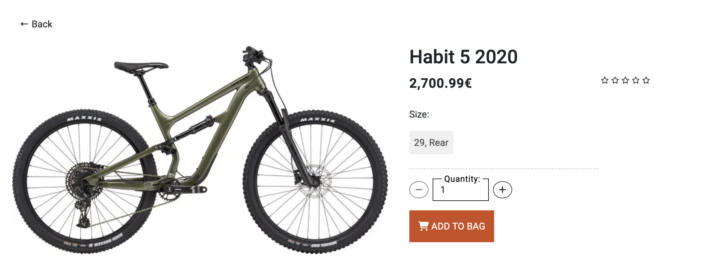
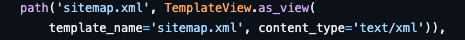
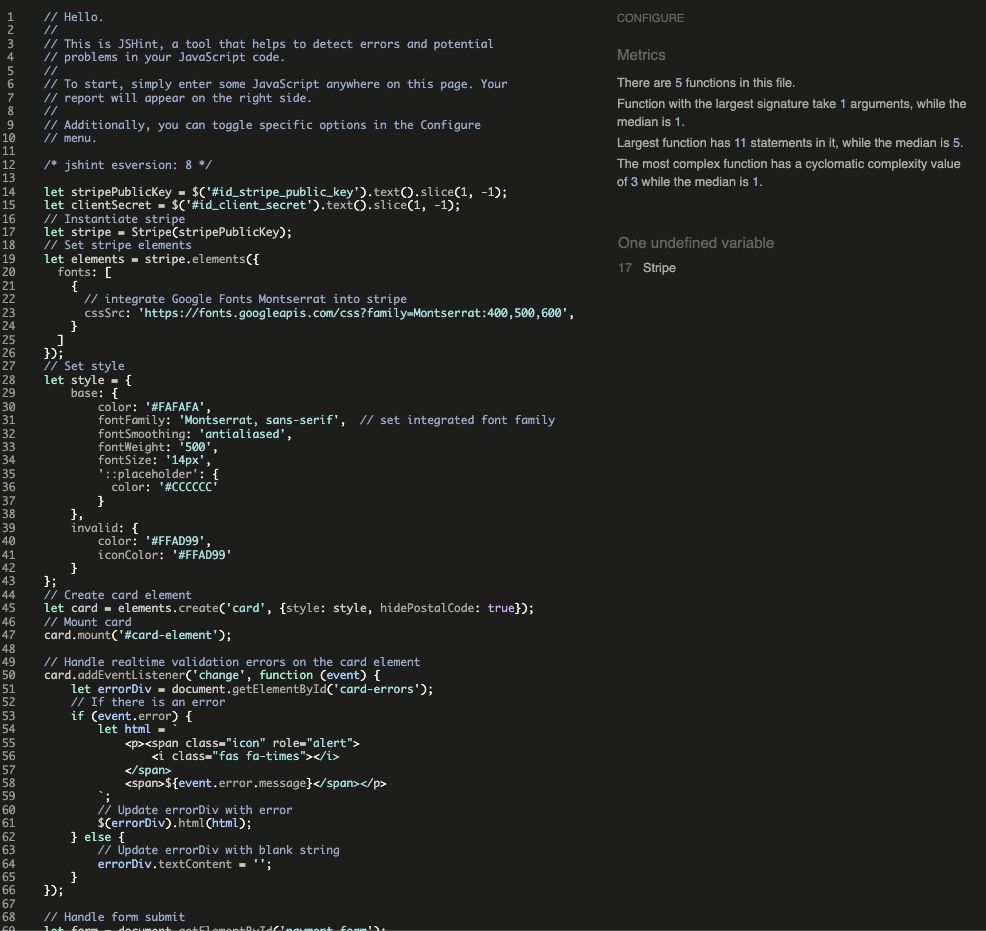

# Testing

## Contents

- [Manual Testing](#manual-testing)
- [Automated Testing](#automated-testing)
- [User Stories Testing](#user-stories-testing)
- [Validator Testing](#validator-testing)
  - [HTML](#html)
  - [CSS](#css)
  - [JS](#js)
  - [Python](#python)
- [Performance Testing](#performance-testing)
  - [Desktop Results](#desktop-results)
  - [Mobile Results](#mobile-results)
- [Browser Compatibility](#browser-compatibility)
- [Responsivity](#responsivity)
- [Issues/ Bugs Found & Resolved](#issues-bugs)

---
Back to the [README](README.md)<br>

## <a name="manual-testing">Manual Testing</a>

The original Google sheet file for the test case report can be found [here](https://docs.google.com/spreadsheets/d/116U8ZYF5RuEg5WTYexFzaFPc--CidQxJqSWv5VdAQPo/edit?usp=sharing).

[Download Manual Testing PDF](documentation/testing/manual-testing/manual-testing.pdf)





## <a name="automated-testing">Automated Testing</a>

Python **Automated Unit Testing** was implemented using the [Django Unit Testing](https://docs.djangoproject.com/en/3.2/topics/testing/overview/) framework.  
**Unit Tests** have been written to cover all major parts of the code like **Forms**, **Models**, **Views**, **Admin**, **Context-Processors** and **Fields**. The tests were created to cover all key aspects of the code. Only the checkout app has a moderate coverage, but here manual testing was applied.
A total of **232** **Unit Tests** have been written. All **232** tests ran successfully without errors or warnings.   

<details>
    <summary>Coverage Automated Testing</summary>
    
    
    
</details>

<br>

## <a name="user-stories-testing">User Stories Testing</a>

All functionalities have been tested and they work as expected. You can find more about [Manual Testing](#manual-testing). 

- **As a site user**,
  - [#9](https://github.com/kerstin-w/Bike-World/issues/9) I want to navigate to the landing page firstly so that I can see what the store is about
    
    This was achieved through an appealing and clearly structured homepage. The user instantly views an attractive herobanner with a call to action. Below that, another reason-why banner. The next section shows the user special category callouts and below that the top products are presented.
    
    

  - [#10](https://github.com/kerstin-w/Bike-World/issues/10) I can navigate through the site from the navbar so that it is easy to access the key components of the site
    
    A responsive navbar was implemented, which is sticky on top, allowing the customer to have the navigation in view at all times. All important navigation points of the site are listed in the navbar. Hover effects have been introduced to make the sub-items even easier to access.
    
    
    
    

  - [#14](https://github.com/kerstin-w/Bike-World/issues/14) I can search for a product by a keyword so that I can find products relative to the keyword
    
    To accomplish this, a search box was created in the navabar and the customer can search for relevant keywords.

    
    

  - [#15](https://github.com/kerstin-w/Bike-World/issues/15) I can create an account so that sign in and make use of the site full functionality

    Django Allauth was used for this purpose. The user can register via the navbar. A modal opens where the user can enter their user data. Afterwards the account is created automatically. A confirmation of the email address is not required to minimize the hurdle of registration. 

    
    

  - [#18](https://github.com/kerstin-w/Bike-World/issues/18) I can log in with my social media accounts so that it is very easy to create an account to use the site

    This is achieved by allowing the user to log in with his google account by clicking on the Google button.

    

  - [#20](https://github.com/kerstin-w/Bike-World/issues/20) I can See a list of products with the ability to click on each item for more information so that I can make informed purchases.

    This was achieved through the category landing pages, which list the products. From the CLP, the user can click on the product and is redirected to the PDP, where detailed information is provided.
    
    

  - [#21](https://github.com/kerstin-w/Bike-World/issues/21) I can select a certain segment so that I can only view relevant products

    This was accomplished using the Activity, Brands & Sale items in the Navabr, as well as the Category Callouts on the homepage. By clicking on a selection, the customer only sees the corresponding products of the respective Activity, Brand or Sale products.

    
    
    

  - [#22](https://github.com/kerstin-w/Bike-World/issues/22) I can sort and filter products so that I can see relevant products to purchase and make a better 
  
    For this purpose, Sort and Filter Function were introduced on CLP. The user can choose a sorting and at the same time filter according to a category and brand. Subsequently, only products that meet the respective criteria are displayed. If no product matches the criteria, the user will be notified. 

    
    

  - [#23](https://github.com/kerstin-w/Bike-World/issues/23) I can add products to my cart so that can review my selected products and make a purchase

    The customer can add products directly to the shopping bag on the home page, through the CLP, the PDP or the Wishlist. By clicking on the CTA on the home page, the CLP or the wishlist, the customer promptly adds one product to the shopping bag. On the PDP the customer can determine the quantity. 

    
    

  - [#24](https://github.com/kerstin-w/Bike-World/issues/24) I can view my shopping cart so that I have an overview of the items I want to purchase

    For this purpose, the customer can click on the bag icon in the navbar. This will open an off canvas showing the contents of the bag. By clicking on the button "Go to Shopping Bag" the customer reaches the complete overview of the bag where also quantities can be modified.

    

    
    

  - [#25](https://github.com/kerstin-w/Bike-World/issues/25) I can adjust the quantity of a product in my cart so that purchase the quantity I desire

    In the shopping bag itself, the customer can increase or decrease the number of items. Also, an item can be deleted directly from the shopping bag. Input errors are displayed accordingly.

    
    
    

  - [#26](https://github.com/kerstin-w/Bike-World/issues/26) I can delete products from my cart so that I don't have to purchase the product in case I changed my mind

    By clicking on the Trash can icon, the user can completely remove the product from the shopping bag.

    
    

  - [#27](https://github.com/kerstin-w/Bike-World/issues/27) I am always informed about actions I take so that I am assured they were successful or receive supportive information in case of an error

    To achieve this, toast messages were used as well as direct messages in the forms that inform the customer about all actions. 

    
    
    
    
    

  - [#28](https://github.com/kerstin-w/Bike-World/issues/28) I am redirected to a checkout page so that I can make a purchase

    By clicking on "Place Your Order" in the off canvas, the customer is taken directly to the checkout where they can enter their details to submit the order.

    

    

  - [#29](https://github.com/kerstin-w/Bike-World/issues/29) I can see a confirmation of my purchase so that I am assured the purchase was successful
    
  - [#32](https://github.com/kerstin-w/Bike-World/issues/32) I can Sign Up for the newsletter so that I can keep up to date with deals and events

    In the footer, the customer can sign up for the newsletter. This registration is registered via MailChimp and the customer is added to the list of subscribers.
    
    
    

  - [#33](https://github.com/kerstin-w/Bike-World/issues/33) I can see an option to get in contact with the shop so that reach out for support

    For this purpose, the Support item with the Contact Us subitem was added to the footer. When the customer clicks on it, a contact form is displayed where the customer can enter their concerns. This then sends an email to the store owner. 

    
    
    

  - [#34](https://github.com/kerstin-w/Bike-World/issues/34) I can find answers to frequently asked questions easily so that I can quickly resolve my queries
    
    For this purpose, the item Support with the subitem FAQs was added in the footer. When the customer clicks on it, they come to all frequently asked questions and this should serve the customer as a help before and after the purchase.

    
    

  - [#35](https://github.com/kerstin-w/Bike-World/issues/35) I can view reviews of products on the online store so that I can make an informed decision before making a purchase

    On the PDP in the Accordion, the customer is shown the reviews section where the customer can read all the written reviews.

    

  - [#42](https://github.com/kerstin-w/Bike-World/issues/42) I can be routed to a error page in case a page is not found so that I understand the error and click on a link to get back to the homepage

    This was achieved with error pages which inform the customer about errors and provide a link back to the homepage.

    

- **As a registered user**,

    - [#16](https://github.com/kerstin-w/Bike-World/issues/16) I can log in and out so that so that I can protect my account and use the sites full functionality

      The user can log in and out via the account icon in the navbar.

      
      

      
      

    - [#17](https://github.com/kerstin-w/Bike-World/issues/17) I can reset my password so that I can always access my account and my account stays secure

      In the login area, the user can reset his password if he has forgotten it. An email with a link will be sent to the user. Clicking on the link will take the user to a page where a new password can be entered.

      
      
      
      

    - [#19](https://github.com/kerstin-w/Bike-World/issues/19) I can receive a welcome email so that I am assured that my account was created successfully

      After a customer has registered, a welcome email is automatically sent to the customer to welcome them to Bike World.

      

    - [#30](https://github.com/kerstin-w/Bike-World/issues/30) I can edit my account so that personal data stays up to date

      In the User Profile under User Info the customer can enter and save their data, or update data already saved.

      

    - [#31](https://github.com/kerstin-w/Bike-World/issues/31) I can delete my account so that I can remove my footprint from the website if I am no longer useing it

      In the User Profile under Delete account a user can delete an account. A modal opens to confirm this decision.

      
      

    - [#36](https://github.com/kerstin-w/Bike-World/issues/36) I can leave a review for a product I have purchased so that I can share my experience with others

      In the User Profile under review, all items are displayed that the user has purchased and not yet rated. If an item was bought twice, it will still be listed there only once. The user can rate the product and write a review.

      

    - [#39](https://github.com/kerstin-w/Bike-World/issues/39) I can create and add products to my wishlist so that I can keep track of products that I am interested in and plan future purchases more easily

      Items can be added to Wishlist via the CLP and PDP by clicking on the regular heart icon/button. The customer can then find this wishlist via the profile under Wishlist. 

      
      
      
      
      

    - [#40](https://github.com/kerstin-w/Bike-World/issues/40) I can see related products on the product detail page (PDP) so that I can easily discover alternative products

      At the end of each PDP the user will find four related products of the same category.

      

- As a **Superuser**,

    - [#11](https://github.com/kerstin-w/Bike-World/issues/11) I can add a new product to the database so that I can expand my assortment

      The Super User can create a new product via Product Management. A form opens that queries all relevant fields.

      
      

    - [#12](https://github.com/kerstin-w/Bike-World/issues/12) I can Edit products so that I can keep all information updated

      Via the CLP or the PDP, the superuser can click Edit and will be redirected to the same form as for Add Products, but it is already pre-filled with the saved data which can then be changed.

      
      
      

    - [#13](https://github.com/kerstin-w/Bike-World/issues/13) I can delete products from the database so that remove obsolete products

      Via the CLP or the PDP, the superuser can click Delete, which will open a Modal to confirm. Afterwards the product is removed from the database.

      
      
      

    - [#41](https://github.com/kerstin-w/Bike-World/issues/41) I can have a dashbaord in the admin panel so that I can view and manage key metrics

    In the admin panel in the top bar, the superuser can click "dashboard" and gets redirected to a dashboard that shows all the important KIPs of the day-to-day business.

    

- As a **store owner**,
    - [#43](https://github.com/kerstin-w/Bike-World/issues/43) I want to create a sitemap and robots.txt file for my website so that search engines can properly index and crawl my pages

      A site map was created for Bike World, which includes all relevant pages. The sitemap was downloaded and added to the root directory. To ensure that Google and other services indeed have access to the sitemap, it was added as `TemplateView` to the urls. For this the [sitemap](templates/sitemap.xml) was moved to the templates folder.

      

      A robots.txt was created to allow crawlers to crawl the page and also to specify which pages should not be crawled. In order to ensure crawlers can really use the robots.txt, a view was created and included in the urls. The robots.txt file was saved in the roots directory, as it was a requirement for this project, but it is not in actual use, as the view sets the parameters for the crawler.

      

      

    - [#44](https://github.com/kerstin-w/Bike-World/issues/44) I want to create a Facebook page for my e-commerce business so that I can increase visibility and engage with customers
      
      A facebook business page has been created to share updates, promotions, and engage with users through comments and messages.

      

    - [#45](https://github.com/kerstin-w/Bike-World/issues/45) I want to quickly understand, how the page works. I need the README file to provide clear and concise instructions and documentation.

      A detailed [README](README.md) file has been created. 


## <a name="validator-testing">Validator Testing</a>

### <a name="html">HTML</a>
All **HTML** code was validated using the [W3C Markup Validation Service](https://validator.w3.org/) regularly during the development process. **The HTML Source Code** was regularly viewed for each page using **Google Chrome** and passed through the [W3C Markup Validation Service](https://validator.w3.org/). Various minor errors were encountered and corrected during the final **HTML** validation check.

A slightly tricky error was the error to the auto-focus. For login/signup I created a modal that loads on all pages. This modal has two tabs: one tab for login and one tab for signup. Accordingly, two forms load in one modal and Crispy Froms automatically sets an auto-focus for each form. Thus, I had more than one auto-focus on the page. I could have manipulated the DOM to enable auto-focus for only the from that is open and disable it otherwise. However, the form would still have been rendered with auto-focus and the test would have returned an error. In the tutoring support we came up with the idea to create a context processor that handles the tags for signup and login. For this I have created a `CustomLoginForm` which disables the auto-focus. The context processor will then load the corresponding `CustomLoginForm` in the `logintag`

A slightly unpleasant error was the duplicate of the `div_id_email` that occurred in the checkout. Crispy Forms creates a wrapper DIV around the input element and assigns the DIV ID `div_id_email` for email. Since I have two forms on the page with email, one being the `OrderForm` and the other being the `login/signup modal`, there was a conflict here. I haven't found a really convinient solution to control the ID of the wrapper DIV with the existing OrderForm setup. One solution would have been to create the OrderForm entirely new with the `Crispy Form Helpers and Layout`. This would have given me the possibility to give the wrapper DIV its own ID. The other option would have been to manually create this input field in the HTML code. This was the solution I chose, as it was less invasive. Later on, I found the proper solution in the Django documentation. With the paramater `auto_id` I was able to control the Id of the wrapper DIV. I reversed the changes from before and the email field is rendered normally again and the DIV ID is now unique for the Login and Signup fields. 

### Errors during validation check

<details>
    <summary>Home Page</summary>
    
</details>
<details>
    <summary>CLP</summary>
    
</details>
<details>
    <summary>Shopping Bag</summary>
    
    
</details>
<details>
    <summary>Checkout</summary>
    
</details>
<details>
    <summary>Profile</summary>
    
    
</details>


### Results validation check

<details>
    <summary>Home Page</summary>
    
</details>
<details>
    <summary>CLP</summary>
    
</details>
<details>
    <summary>PDP</summary>
    
</details>
<details>
    <summary>Shopping Bag</summary>
    
</details>
<details>
    <summary>Checkout</summary>
    
</details>
<details>
    <summary>Profile</summary>
    
</details>
<details>
    <summary>Contact Us</summary>
    
</details>
<details>
    <summary>FAQs</summary>
    
</details>
<details>
    <summary>Return Policy</summary>
    
</details>
<details>
    <summary>PrivacyPolicy</summary>
    
</details>
<details>
    <summary>TCs</summary>
    
</details>


### <a name="css">CSS</a>

**Custom CSS Styling** from [admin.css](admin/static/admin/css/admin.css), [base.css](static/css/base.css), [bag.css](bag/static/bag/css/bag.css), 
[checkout.css](checkout/static/checkout/css/checkout.css), [products.css](products/static/products/css/products.css), [profiles.css](profiles/static/profiles/css/profiles.css) and [support.css](support/static/support/css/support.css).
was validated using the [W3C CSS Validation Service](https://jigsaw.w3.org/css-validator/).  
No errors were generated.

### Results

<details>
    <summary>Base.css</summary>
    
</details>
<details>
    <summary>Admin.css</summary>
    
</details>
<details>
    <summary>Bag.css</summary>
    
</details>
<details>
    <summary>Checkout.css</summary>
    
</details>
<details>
    <summary>Products.css</summary>
    
</details>
<details>
    <summary>Profiles.css</summary>
    
</details>
<details>
    <summary>Support.css</summary>
    
</details>
<details>
    <summary>quantity_input.css</summary>
    
</details>

### <a name="js">JavaScript</a>

The custom scripts, were validated using the [JSHint](https://jshint.com/about/) static code analysis tool. Due to the lack of complexity of **JavaScript** code implemented on the project, **Automated Unit Testing** of the **JavaScript** code was considered unnecessary. All **JavaScript** functions and event handlers in the custom **JavaScript Code Libraries** have been thoroughly manually debugged and tested in the console.

In checkout a warning was displayed that the variable Stripe is undefined. However, this is defined by the Stripe JS and therefore this message was not pursued further.

### Results

<details>
    <summary>Bag</summary>
    
</details>
<details>
    <summary>Checkout</summary>
    
</details>
<details>
    <summary>Products</summary>
    
    
    
    
</details>
<details>
    <summary>Profiles</summary>
    
    
    
</details>
<br>


### <a name="Python">Python</a>

All **Python Code** was thoroughly de-bugged and tested at the command line during the development process, and has been validated 
using [Flake8](https://flake8.pycqa.org/). [flake8-django](https://pypi.org/project/flake8-django/) was also installed to assist with validation.  
**Flake8** was configured by creating a `setup.cfg` file in the root of the project, which contains the following settings:
```
[flake8]
exclude = */migrations/*.py, *__init__.py, *_pychache_*, .vscode, *settings.py*,
per-file-ignores = *apps.py:F401, *env.py:E501,
```
The settings exclude **django** migrations, `__init__.py`, `.vscode` and `_pychache_` files, as these are system generated files and do not need to be checked.  
*settings.py* (line too long) errors are ignored as it is not possible to shorten the affected lines of code without causing application errors.  
*env.py* (line too long) errors are ignored as it is not possible to shorten the affected lines of code without causing application errors.
*F401* (imported but unused) errors are ignored for *apps.py, as **Flake8** was generating an error on **Django** signals being imported but unused. 
Signals need to be imported into the **app** config files to ensure correct operation of the code.  

<details>
    <summary>Result</summary>
    
</details>

<br>

## <a name="performance-testing">Performance Testing</a>

Lighthouse was used (accessed through Developer Tools in Chrome) to analyzee for the following:

- Performance
- Accessibility
- Best practice
- SEO

To improve the score I converted all product pictures to webp, which resulted in slightly better performance scores.

On the **Shopping Bag** page the SEO score raised an issue related to the *Page is blocked from indexing* and *Links are not crawlable*. This related to the robots.txt and this page beeing disallowed to be crawled. 

On several pages for **mobile** the performance score raised issues related to Bootstrap and Heroku: *Eliminate render-blocking resources.* As Bootstrap and Heroku are not replaceable at this point, I have decided not to pursue any further. To further improve performance, consideration should be given in a **Future Development Phase** to optimising **Bootstrap** by only importing the required components. See this [Link](https://getbootstrap.com/docs/5.0/customize/optimize/) for further information. Another cause for the lower performance score on mobile is **unused JavaScript**. This is caused partly by **Stripe**. The Stripe script must be loaded on all pages, so that Stripe can fully track the activity of the users and make a valid fraud assessment. Therefore, this script cannot only be placed in the checkout but is loaded on all pages. The script for newsletters is also referenced, but this must also be available on all pages, as the newsletter signup is provided in the footer. Only the script which is loaded with the facebook pixel could have been removed. Since no actual facebook advertising measures are carried out yet, the facebook pixel is rather installed for demonsatration purposes, but has no added value for the page and could therefore be removed. However, I decided to leave it in for the completeness of the marketing part. The analysis also indicated that **HTTP/2** should be used. This needs to be setup on the server side. An attempt was made to set this up on Heroku. However, this feature does not seem to be supported by heroku yet. [Link](https://github.com/heroku/roadmap/issues/34)
I am conscious that PageSpeed is an important factor in eCommerce and a slow website quickly results in customers abandoning the site. The page has an acceptable PageSpeed on mobile and sufficient for the scope of this project. For a real-world project, however, the voice actions would have to be made here. 

### <a name="desktop-results">Desktop Results</a>

<details>
<summary>Homepage</summary>


</details>
<details>
<summary>CLP</summary>


</details>
<details>
<summary>PDP</summary>


</details>
<details>
<summary>Bag</summary>


</details>
<details>
<summary>Checkout</summary>


</details>
<details>
<summary>Profile</summary>


</details>
<details>
<summary>Contact Us</summary>


</details>
<details>
<summary>FAQs</summary>


</details>

### <a name="mobile-results">Mobile Results</a>

<details>
<summary>Homepage</summary>


</details>
<details>
<summary>CLP</summary>


</details>
<details>
<summary>PDP</summary>


</details>
<details>
<summary>Bag</summary>


</details>
<details>
<summary>Checkout</summary>


</details>
<details>
<summary>Profile</summary>


</details>
<details>
<summary>Contact Us</summary>


</details>
<details>
<summary>FAQs</summary>


</details>


## <a name="browser-compatibility">Browser Compatibility</a>

This App was tested on Chrome, Microsoft Edge, and Firefox for desktop.

The App was tested on Safari for mobile and tablet.

I was able to directly test the website on a **MacBook Air**.

<br>

## <a name="responsivity">Responsivity</a>

Responsiveness was tested through Chrome Developer tools. The devices tested include:

- iPhone SE
- iPhone XR
- iPhone 12 Pro
- Pixel 5
- Samsung Galaxy S8+
- Samsung Galaxy S20 Ultra
- iPad Air
- iPad Mini
- Surface Pro 7
- Surface Duo
- Galaxy Fold
- Samsung Galaxy A51

I was able to directly test the website on an **iPhone 13** mini and an **iPad**.

## <a name="issues-bugs">Issues/ Bugs Found & Resolved</a>

- **Data Base Issue**:

I wanted to move the `ProductReview* form the Profiles app to the Products app. I created the ProductReview first in the profiles app. When moving, I changed the "rating" field of the Product Data model to a foreignkey field which caused an issue in the data base:
```
django.db.utils.IntegrityError: The row in table 'products_product' with primary key '1' has an invalid foreign key: products_product.rating_id contains a value '4' that does not have a corresponding value in products_productreview.id.
```

To fix this, I had to delete the complete data base and also delete all migrations. Afterwards, I ran migrations again and uploaded fixtures again.

- **Button hover effect**:

I implemented a hover effect for CTA Buttons which would scale them bigger. `Scale` caused the text inside the button to be blurry whilste the size of the buttons was still in the scaling process (getting larger). To solve this I tried using `translateZ(0)`, `backface-visibility: hidden` and `transform-style: preserve-3d` and achived a slight improvement, but nothing made the text really crispy sharp. Therefore, I decided to go for a `box-shadow`effect instead. 

- **Input validation for quantity out of range for add to bag input**:

In my JavaScript (add_products_to_bag_script.html) file an error message in place, which would display if the input was out of range. The issue was, that the quantity was still submitted. eg. a User enters Quantity: -11, it would add -11 of a certain product to the bag. Therefore, I added validation to the `AddToBagView` to handle non-numeric input and restrict the quantity within the range of 1-99. This ensures that only valid quantities are added to the shopping bag. The error messages are returned as JSON responses with appropriate status codes for better user feedback.

- **image_url for image tag**:

In the Product data model I implemented a method `image_tag`that generates an HTML image tag for the product image in the admin panel list_display. The image src for the image tag had a hard coded path and would not work in the live admin panel, as the path was not leading to AWS. This was fixed by adding `settings_MEDIA_URL` to construct the complete URL for the product image
